# Manual Técnico — Proyecto 1 SOPES 1
**Sonda de Kernel en C y Daemon en Go para Telemetría de Contenedores**
Universidad San Carlos de Guatemala · Facultad de Ingeniería
Estudiante: 202308204 · Vacaciones Junio 2026

---

## Tabla de Contenidos

1. [Descripción General del Sistema](#1-descripción-general-del-sistema)
2. [Arquitectura del Sistema](#2-arquitectura-del-sistema)
3. [Fase 1 — Módulo de Kernel en C](#3-fase-1--módulo-de-kernel-en-c)
4. [Fase 2 — Entorno Docker](#4-fase-2--entorno-docker)
5. [Fase 3 — Script del Cronjob](#5-fase-3--script-del-cronjob)
6. [Fase 4 — Daemon en Go](#6-fase-4--daemon-en-go)
7. [Fase 5 — Dashboard en Grafana](#7-fase-5--dashboard-en-grafana)
8. [Flujo de Datos Completo](#8-flujo-de-datos-completo)
9. [Guía de Instalación](#9-guía-de-instalación)
10. [Estructura del Repositorio](#10-estructura-del-repositorio)
11. [Dependencias y Versiones](#11-dependencias-y-versiones)
12. [Restricciones y Reglas de Negocio](#12-restricciones-y-reglas-de-negocio)
13. [Solución de Problemas](#13-solución-de-problemas)

---

## 1. Descripción General del Sistema

El proyecto implementa un sistema integral de monitoreo y gestión autónoma de contenedores Docker en entornos Linux. El sistema opera en cuatro capas que se comunican entre sí:

- **Capa 0 (Kernel):** Un módulo C accede directamente a las estructuras internas del kernel Linux (`task_struct`, `si_meminfo`) para capturar métricas en tiempo real de memoria RAM y procesos. Los datos se exponen a través del sistema de archivos virtual `/proc`.

- **Capa 1 (Orquestación):** Un daemon escrito en Go lee periódicamente el archivo `/proc`, toma decisiones autónomas sobre qué contenedores mantener o eliminar, expone métricas para Prometheus y persiste logs en Valkey.

- **Capa 2 (Carga de trabajo simulada):** Un script de shell ejecutado por cron cada 2 minutos crea 5 contenedores Docker aleatorios de tres perfiles de consumo distintos.

- **Capa 3 (Visualización):** Grafana consulta Prometheus como fuente de datos y presenta 8 paneles interactivos con estado del sistema en tiempo real.

---

## 2. Arquitectura del Sistema

### 2.1 Diagrama de Arquitectura General

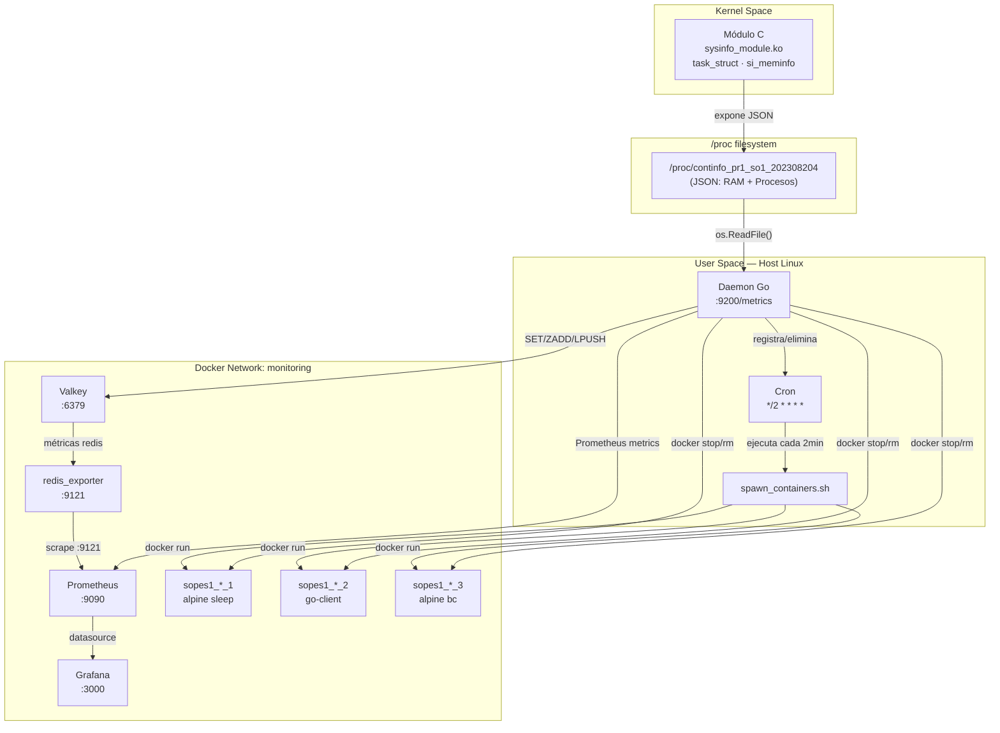

### 2.2 Diagrama de Componentes

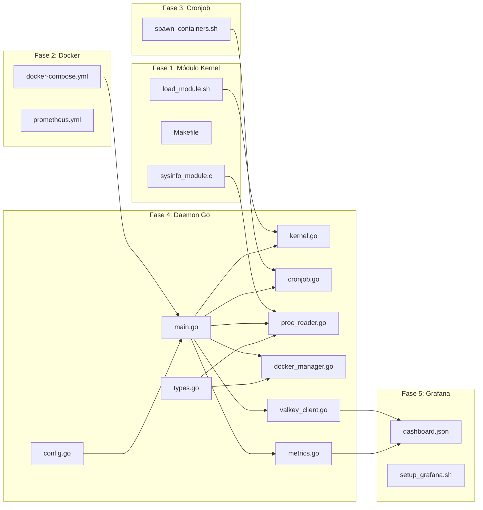

### 2.3 Diagrama de Secuencia — Ciclo de Vida del Daemon

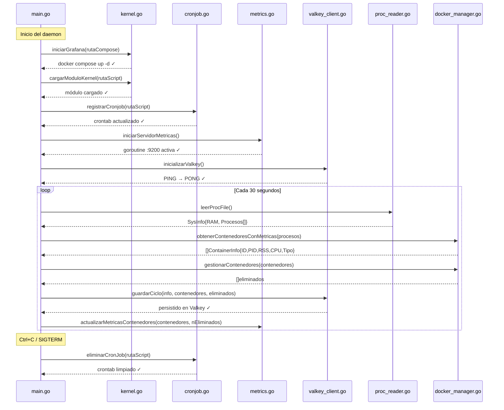

---

## 3. Fase 1 — Módulo de Kernel en C

### 3.1 Descripción

El módulo `sysinfo_module` (compilado como `sys_info_module.ko`) es un Loadable Kernel Module (LKM) que se inyecta en el kernel Linux en tiempo de ejecución. Al cargarse, crea el archivo `/proc/continfo_pr1_so1_202308204` que retorna un JSON con el estado completo del sistema.

### 3.2 Archivo `/proc` — Formato JSON

```json
{
  "Totalram": 12039728,
  "Freeram": 564944,
  "Usedram": 11474784,
  "Procs": 419,
  "Processes": [
    {
      "PID": 1,
      "Name": "systemd",
      "Cmdline": "/sbin/init splash",
      "vsz": 102400,
      "rss": 8192,
      "Memory_Usage": 0.1,
      "CPU_Usage": 0.00
    }
  ]
}
```

Todos los valores de memoria están en **KB**. `Memory_Usage` es porcentaje con 1 decimal. `CPU_Usage` es porcentaje acumulado con 2 decimales (puede exceder 100% por diseño del kernel).

### 3.3 Flujo Interno del Módulo

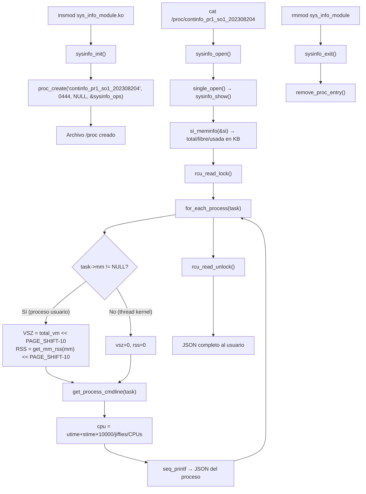

### 3.4 Decisiones de Diseño

| Decisión | Razón |
|---|---|
| `rcu_read_lock/unlock` | Protege el acceso concurrente a la lista `task_struct` sin bloquear el scheduler |
| `PAGE_SHIFT - 10` para VSZ/RSS | Convierte páginas (4096 bytes) a KB: `× 4096 / 1024 = × 4 = << 2` |
| `get_task_comm()` en vez de `task->comm` directamente | Evita condición de carrera al leer el nombre del proceso |
| `kmalloc / kfree` para cmdline | Asignación dinámica segura en el espacio del kernel |
| `sanitize_for_json()` | Reemplaza `"` y `\` para garantizar JSON válido aunque el nombre de proceso contenga caracteres especiales |
| `single_open` + `seq_file` | Patrón estándar del kernel para archivos `/proc` que generan salida variable |

### 3.5 Comandos del Makefile

| Comando | Función |
|---|---|
| `make` | Compila → genera `sys_info_module.ko` |
| `make load` | Compila + `sudo insmod` |
| `make unload` | `sudo rmmod` |
| `make reload` | `rmmod` + `make` + `insmod` |
| `make test` | `cat /proc/... | python3 -m json.tool` |
| `make log` | `dmesg | grep SOPES1` |
| `make status` | Estado actual en `lsmod` |

---

## 4. Fase 2 — Entorno Docker

### 4.1 Servicios del Docker Compose

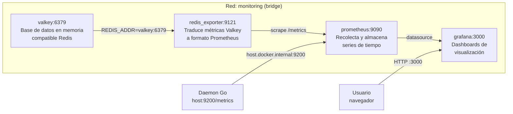

### 4.2 Imágenes de Contenedores de Prueba

| Categoría | Imagen | Comando | Perfil |
|---|---|---|---|
| Alto RAM | `roldyoran/go-client` | `docker run -d roldyoran/go-client` | Consumo significativo de RAM |
| Alto CPU | `alpine` | `docker run -d alpine sh -c "while true; do echo '2^20' \| bc > /dev/null; sleep 2; done"` | Bucle matemático intensivo |
| Bajo consumo | `alpine` | `docker run -d alpine sleep 240` | Inactivo durante 4 minutos |

### 4.3 Configuración de Prometheus (`prometheus.yml`)

Dos targets de scraping cada 15 segundos:

- `valkey` → `redis_exporter:9121` (métricas de la base de datos)
- `daemon_go` → `host.docker.internal:9200` (métricas del sistema vía daemon)

La directiva `extra_hosts: host.docker.internal:host-gateway` en el compose permite que Prometheus dentro de Docker alcance el daemon que corre en el host.

---

## 5. Fase 3 — Script del Cronjob

### 5.1 Lógica del Script

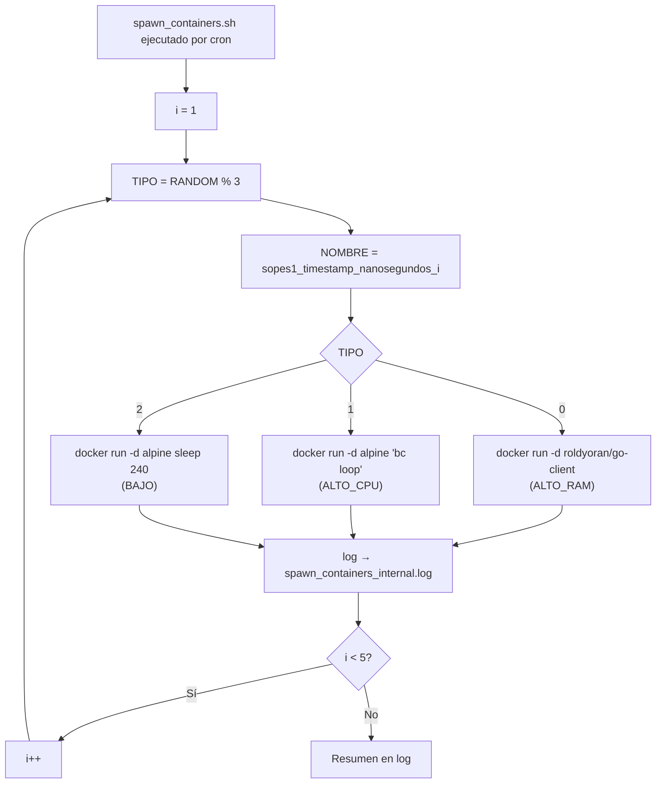

### 5.2 Registro del Cronjob desde Go

El daemon registra y elimina el cronjob programáticamente:

```
Registro:   (crontab -l 2>/dev/null; echo "*/2 * * * * /ruta/spawn_containers.sh >> ...log 2>&1") | crontab -
Eliminación: crontab -l 2>/dev/null | grep -v "spawn_containers.sh" | crontab -
```

El patrón cron `*/2 * * * *` ejecuta el script exactamente cada 2 minutos.

---

## 6. Fase 4 — Daemon en Go

### 6.1 Estructura de Archivos

| Archivo | Responsabilidad |
|---|---|
| `config.go` | Constantes de configuración (rutas, puertos, intervalos) |
| `types.go` | Estructuras de datos: `Process`, `SysInfo`, `ContainerInfo`, `TipoContenedor` |
| `main.go` | Punto de entrada, secuencia de inicialización, loop principal |
| `kernel.go` | Carga del módulo kernel (script + fallback directo) |
| `cronjob.go` | Registro y eliminación del cronjob en crontab |
| `proc_reader.go` | Lectura y parseo del JSON de `/proc` |
| `docker_manager.go` | Listado, clasificación y eliminación de contenedores |
| `valkey_client.go` | Persistencia de métricas en Valkey (Redis protocol) |
| `metrics.go` | Servidor HTTP Prometheus en `:9200` |

### 6.2 Lógica de Gestión de Contenedores

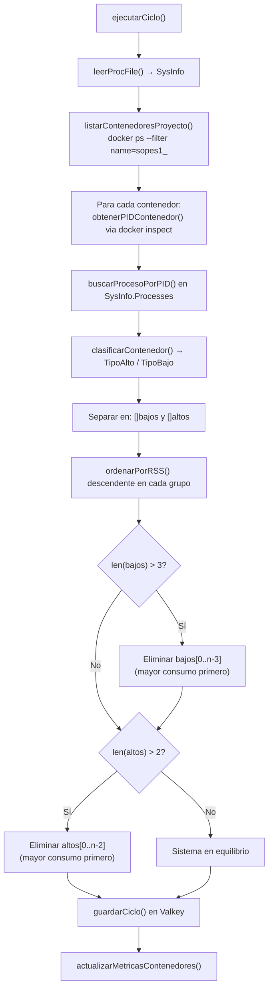

### 6.3 Clasificación de Contenedores

| Imagen / Comando | Tipo asignado | Criterio |
|---|---|---|
| Contiene `go-client` o `roldyoran` | `TipoAlto` | Imagen de alto RAM |
| Contiene `bc` o `while` en comando | `TipoAlto` | Alpine con bucle CPU |
| Cualquier otro (alpine sleep) | `TipoBajo` | Bajo consumo por defecto |

### 6.4 Métricas Expuestas en Prometheus (`:9200/metrics`)

**Métricas del sistema (colectadas en cada scrape desde `/proc`):**

| Métrica | Tipo | Descripción |
|---|---|---|
| `sysinfo_ram_total_kb` | Gauge | RAM total en KB |
| `sysinfo_ram_free_kb` | Gauge | RAM libre en KB |
| `sysinfo_ram_used_kb` | Gauge | RAM usada en KB |
| `sysinfo_process_count` | Gauge | Total de procesos activos |
| `sysinfo_process_vsz_kb{pid,name,cmdline}` | Gauge | VSZ por proceso |
| `sysinfo_process_rss_kb{pid,name,cmdline}` | Gauge | RSS por proceso |
| `sysinfo_process_memory_percent{pid,name,cmdline}` | Gauge | % RAM por proceso |
| `sysinfo_process_cpu_percent{pid,name,cmdline}` | Gauge | % CPU por proceso |

**Métricas de contenedores (actualizadas por el daemon en cada ciclo):**

| Métrica | Tipo | Descripción |
|---|---|---|
| `sopes1_containers_eliminated_total` | Counter | Total acumulado de eliminaciones |
| `sopes1_active_containers_alto` | Gauge | Contenedores altos activos |
| `sopes1_active_containers_bajo` | Gauge | Contenedores bajos activos |

### 6.5 Claves en Valkey

| Clave | Tipo | Contenido | TTL |
|---|---|---|---|
| `memoria:actual` | String (JSON) | Snapshot de RAM actual | Sin expiración |
| `memoria:historia` | List (JSON) | Historial de snapshots (máx 1000) | Sin expiración |
| `contenedor:{id}` | String (JSON) | Estado de cada contenedor | 1 hora |
| `ranking:ram` | Sorted Set | Score=RSS, Member=nombre | Sin expiración |
| `ranking:cpu` | Sorted Set | Score=CPU%, Member=nombre | Sin expiración |
| `eliminados:log` | List (JSON) | Registro de eliminaciones (máx 1000) | Sin expiración |
| `eliminados:total` | String (int) | Contador global de eliminaciones | Sin expiración |
| `eliminado:{nano}` | String (JSON) | Registro individual con timestamp | 24 horas |

---

## 7. Fase 5 — Dashboard en Grafana

### 7.1 Paneles del Dashboard

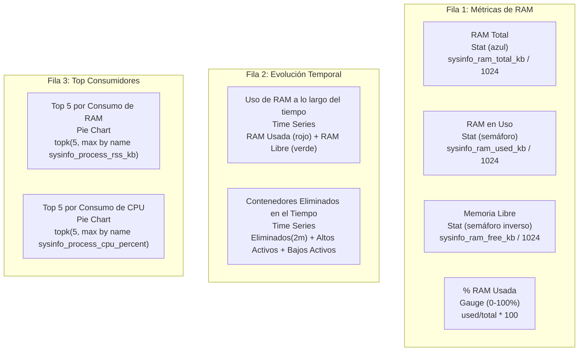

### 7.2 Queries PromQL Principales

```
# Métricas de RAM (instant)
sysinfo_ram_total_kb / 1024           → MB totales
sysinfo_ram_used_kb / 1024            → MB en uso
sysinfo_ram_free_kb / 1024            → MB libres
sysinfo_ram_used_kb / sysinfo_ram_total_kb * 100  → % uso

# Series de tiempo (range)
sysinfo_ram_used_kb / 1024            → evolución RAM usada
sysinfo_ram_free_kb / 1024            → evolución RAM libre
increase(sopes1_containers_eliminated_total[2m])  → eliminados en ventana 2m
sopes1_active_containers_alto         → altos activos actuales
sopes1_active_containers_bajo         → bajos activos actuales

# Top 5 consumidores (instant)
topk(5, max by (name) (sysinfo_process_rss_kb)) / 1024
topk(5, max by (name) (sysinfo_process_cpu_percent))
```

---

## 8. Flujo de Datos Completo

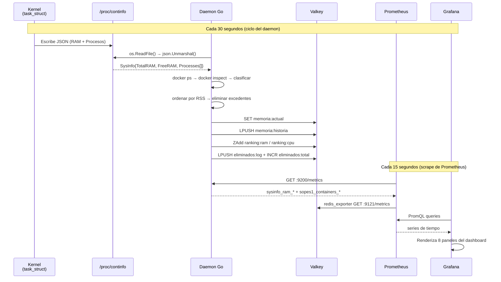

---

## 9. Guía de Instalación

### 9.1 Requisitos Previos

```bash
# Sistema operativo
uname -r    # Linux kernel >= 5.15

# Herramientas de compilación
sudo apt update
sudo apt install -y linux-headers-$(uname -r) build-essential gcc make

# Go 1.21+
go version

# Docker + Docker Compose
docker --version
docker compose version

# Cron activo
systemctl status cron
```

### 9.2 Orden de Instalación

```mermaid
flowchart LR
    A["1. Clonar repositorio"] --> B["2. Compilar módulo kernel<br/>cd kernel_module && make"]
    B --> C["3. Cargar módulo<br/>sudo insmod sys_info_module.ko"]
    C --> D["4. Crear red Docker<br/>docker network create monitoring"]
    D --> E["5. Levantar stack<br/>cd docker && bash setup_entorno.sh"]
    E --> F["6. Ajustar config.go<br/>con rutas absolutas"]
    F --> G["7. Compilar daemon<br/>cd daemon && go mod tidy && go build"]
    G --> H["8. Ejecutar daemon<br/>sudo ./daemon_sopes1"]
    H --> I["9. Esperar 2-4 minutos<br/>para que el cronjob genere datos"]
    I --> J["10. Abrir Grafana<br/>http://localhost:3000"]
```

### 9.3 Verificación por Fase

```bash
# Fase 1 — Módulo kernel
lsmod | grep sys_info_module
cat /proc/continfo_pr1_so1_202308204 | python3 -m json.tool

# Fase 2 — Docker stack
docker compose -f docker/docker-compose.yml ps

# Fase 3 — Script (prueba manual)
bash scripts/spawn_containers.sh
docker ps --filter "name=sopes1_"

# Fase 4 — Daemon y métricas
curl http://localhost:9200/metrics | grep sysinfo_ram
curl http://localhost:9200/health

# Fase 5 — Grafana targets
# Abrir: http://localhost:9090/targets
# Verificar: daemon_go → UP, valkey → UP
```

---

## 10. Estructura del Repositorio

```
202308204_LAB_SO1_VacJun2026/
├── kernel_module/
│   ├── sys_info_module.c       ← Código fuente del módulo
│   ├── Makefile                ← Build system del kernel
│   ├── load_module.sh          ← Script de carga segura
│   ├── unload_module.sh        ← Script de descarga
│   └── test_module.sh          ← Suite de pruebas automáticas
├── docker/
│   ├── docker-compose.yml      ← Stack: Valkey + redis_exporter + Prometheus + Grafana
│   ├── prometheus.yml          ← Configuración de scraping
│   ├── setup_entorno.sh        ← Instalación completa (primera vez)
│   ├── test_entorno.sh         ← Suite de pruebas del stack
│   └── test_imagenes.sh        ← Prueba de los 3 tipos de contenedor
├── scripts/
│   ├── spawn_containers.sh     ← Script del cronjob (crea 5 contenedores)
│   └── test_spawn.sh           ← Suite de pruebas del script
├── daemon/
│   ├── config.go               ← Configuración central (EDITAR rutas)
│   ├── types.go                ← Estructuras de datos
│   ├── main.go                 ← Punto de entrada + loop principal
│   ├── kernel.go               ← Gestión del módulo kernel
│   ├── cronjob.go              ← Gestión del crontab
│   ├── proc_reader.go          ← Lectura de /proc
│   ├── docker_manager.go       ← Gestión de contenedores Docker
│   ├── valkey_client.go        ← Cliente Valkey (go-redis)
│   ├── metrics.go              ← Servidor Prometheus :9200
│   ├── go.mod
│   └── go.sum
├── grafana/
│   ├── dashboard.json          ← Dashboard importable
│   └── setup_grafana.sh        ← Configuración automática vía API
├── SKILL/                      ← Documentación de referencia del proyecto
├── README.md
└── ESTADO_VERIFICACION.md
```

---

## 11. Dependencias y Versiones

| Componente | Versión | Uso |
|---|---|---|
| Linux Kernel | >= 5.15 | API del módulo (proc_ops, task_struct) |
| GCC | cualquier | Compilación del módulo C |
| Go | 1.21 | Compilación del daemon |
| github.com/redis/go-redis/v9 | v9.5.1 | Cliente Valkey desde Go |
| github.com/prometheus/client_golang | v1.19.1 | Servidor de métricas |
| Docker | >= 24 | Contenedores |
| Docker Compose | >= 2.0 | Orquestación del stack |
| Valkey | latest | Base de datos en memoria |
| redis_exporter (oliver006) | latest | Bridge Valkey → Prometheus |
| Prometheus | latest | Almacenamiento de series de tiempo |
| Grafana | latest | Visualización |

---

## 12. Restricciones y Reglas de Negocio

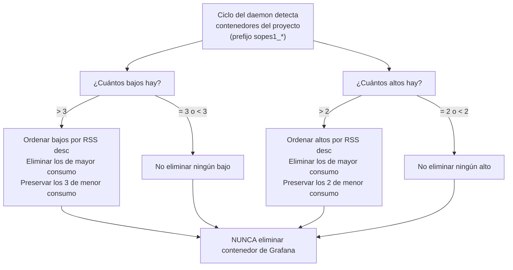

**Reglas absolutas:**

1. Siempre deben existir exactamente **3 contenedores de bajo consumo** activos.
2. Siempre deben existir exactamente **2 contenedores de alto consumo** activos.
3. El contenedor de Grafana (parte del compose) **nunca se elimina**.
4. Los contenedores del proyecto siempre llevan el prefijo `sopes1_`.
5. El criterio de eliminación es: mayor consumo de RAM (RSS) es eliminado primero.
6. El daemon elimina el cronjob antes de apagarse (limpieza al recibir `SIGTERM`/`SIGINT`).

---

## 13. Solución de Problemas

### 13.1 Árbol de Diagnóstico

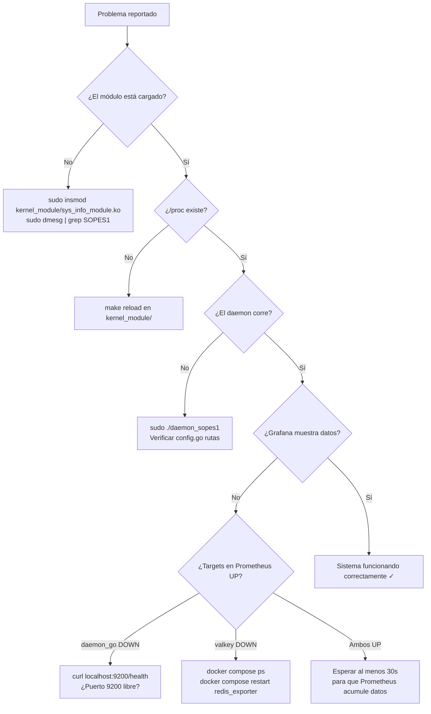

### 13.2 Errores Comunes y Soluciones

| Error | Causa | Solución |
|---|---|---|
| `insmod: ERROR: could not insert module` | Módulo desactualizado o formato incorrecto | `make clean && make && sudo insmod sys_info_module.ko` |
| `no se pudo leer /proc/continfo_...` | Módulo no cargado | `sudo insmod sys_info_module.ko` |
| `no se pudo conectar a Valkey` | Stack Docker no corre | `docker compose -f docker/docker-compose.yml up -d` |
| `permission denied` al cargar módulo | Falta sudo | Ejecutar daemon con `sudo go run .` |
| Target `daemon_go` DOWN en Prometheus | Puerto 9200 no accesible desde Docker | Verificar `extra_hosts: host.docker.internal:host-gateway` en compose |
| Paneles Grafana sin datos | Prometheus aún no tiene métricas | Esperar 30-60s después de iniciar el daemon |
| `tee: /tmp/spawn_containers.log: Permiso denegado` | Cron ejecuta el script sin permisos sobre `/tmp` | El script usa `spawn_containers_internal.log` en su propio directorio |
| JSON inválido en `/proc` | Caracteres especiales en nombre de proceso | `sanitize_for_json()` los reemplaza — verificar con `make test` |