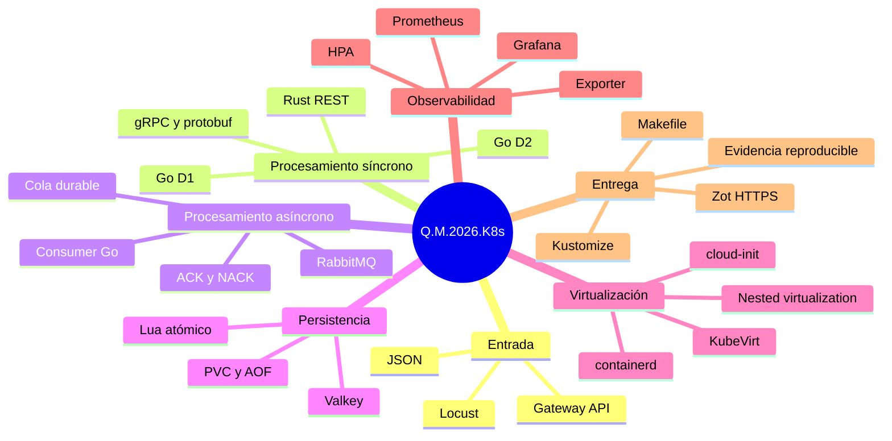
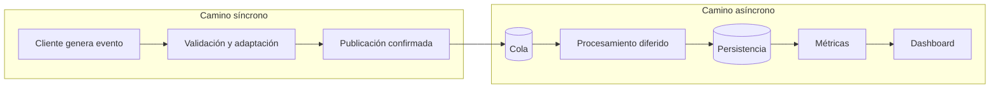
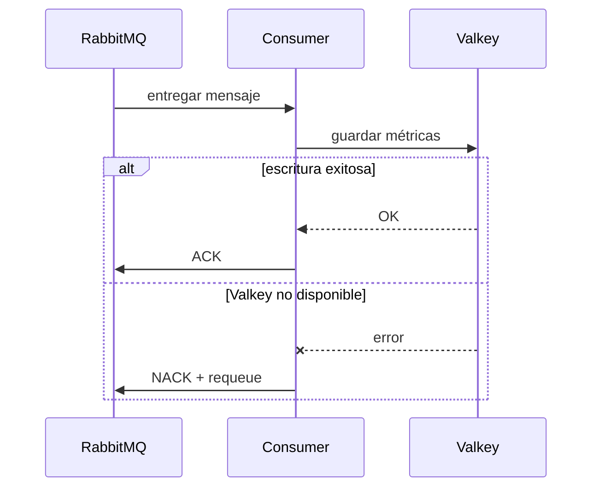
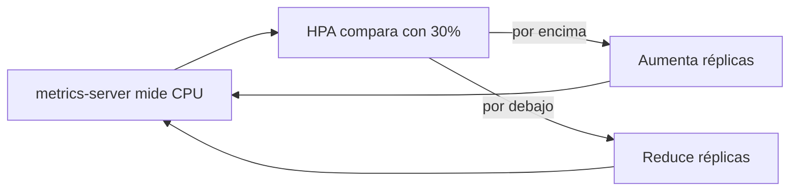
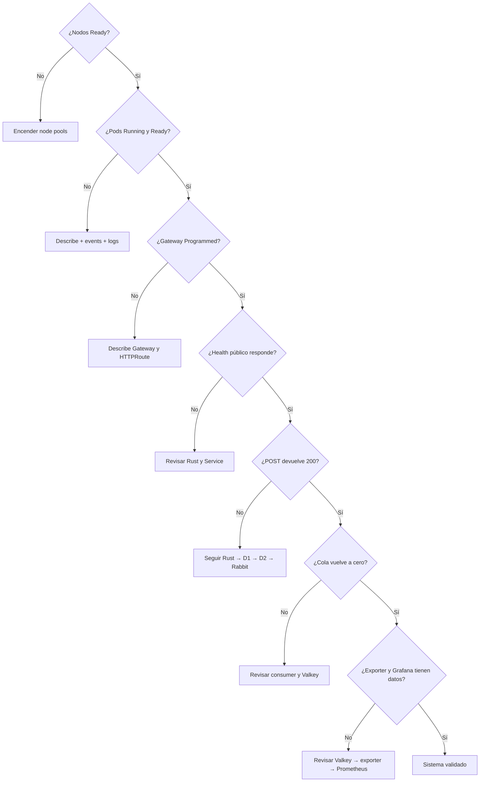

# Aprendizaje del Proyecto 2 — Q.M.2026.K8s

## 1. Qué debía aprender

El propósito del proyecto no era únicamente lograr que una petición terminara en un dashboard.
La meta era comprender cómo varias capas de un sistema distribuido cooperan y fallan:

- construir y publicar imágenes reproducibles;
- desplegar y conectar microservicios en Kubernetes;
- distinguir comunicación síncrona de mensajería asíncrona;
- asegurar persistencia y confirmación de mensajes;
- ejecutar VMs dentro de Kubernetes mediante KubeVirt;
- administrar contenedores con containerd dentro de esas VMs;
- exponer una aplicación con Gateway API;
- medir, visualizar y escalar según carga real;
- diagnosticar fallos usando estado, eventos, logs y pruebas de extremo a extremo.

La lección central es que un sistema distribuido no se considera correcto porque cada programa
compile. Es correcto cuando los contratos, la red, la persistencia, las dependencias, los
reinicios y la observabilidad funcionan como un conjunto.

## 2. Modelo mental del proyecto

## 3. El flujo explicado desde cero

Una predicción nace en Locust como JSON. Gateway API recibe el tráfico público y decide a qué
Service enviarlo según la ruta. Rust funciona como fachada: entiende HTTP, valida y controla
errores. Go D1 adapta la solicitud al contrato protobuf y realiza una llamada gRPC a Go D2.
Go D2 publica el evento en RabbitMQ. Hasta aquí el camino es síncrono: si una capa falla, la
respuesta pública debe reflejarlo.

Después de RabbitMQ comienza el camino asíncrono. El consumer recibe el mensaje cuando puede,
lo procesa y actualiza Valkey. Solo entonces confirma el mensaje. El exporter transforma el
modelo de Valkey en métricas; Prometheus las recolecta y Grafana las presenta.

Comprender esta frontera explica por qué un HTTP 200 significa “RabbitMQ aceptó el evento”,
pero no necesariamente “Grafana ya lo dibujó”.

## 4. Aprendizaje por tecnología

### 4.1 Contenedores e imágenes

Una imagen contiene el programa y sus dependencias; un contenedor es una ejecución de esa
imagen. Los Dockerfiles multi-stage permiten compilar con una imagen grande y ejecutar con una
mínima. Tags inmutables como `v3` o `v6` hacen visible qué versión está desplegada.

También aprendí que “construir” y “publicar” son pasos distintos. GKE y las VMs no consumen mi
imagen local: necesitan descargarla desde Zot. Por eso la prueba completa exige build, push,
pull y ejecución.

### 4.2 Zot y distribución OCI

Zot implementa la API de un registry OCI. HTTPS no es un detalle cosmético: los runtimes
rechazan o requieren configuración especial para registries inseguros. Usar un certificado
confiable permitió que GKE y containerd descargaran imágenes sin modificar cada nodo.

El registry se dejó fuera del clúster para evitar una dependencia circular: si GKE está
apagado, Zot sigue siendo el origen externo desde el cual se recuperan las imágenes al volver
a encenderlo.

### 4.3 Kubernetes declarativo

Un Deployment expresa el estado deseado; Kubernetes intenta mantenerlo. Un Service proporciona
un nombre y una IP estables aunque cambien los Pods. Labels y selectors conectan ambos recursos.
Kustomize reúne los manifiestos sin duplicarlos y `kubectl apply` hace la operación idempotente.

Aprendí a no depender del nombre completo de un Pod, porque incluye hashes y cambia. Para logs,
Services y consultas se usan labels, por ejemplo `app=go-d2`.

### 4.4 Pods con varios contenedores

Los contenedores de un Pod comparten red y ciclo de vida. Por ello Go D1 puede comunicar sus
dos procesos por `localhost`, al igual que Go D2. No se crea un Service para una comunicación
que nunca sale del Pod.

La separación conserva responsabilidad individual: REST, cliente gRPC, servidor gRPC y writer
AMQP pueden tener imágenes y probes diferentes. El costo es que una mala salud de un contenedor
afecta la disponibilidad de todo el Pod.

### 4.5 REST y propagación de errores

REST fue útil en la frontera porque Locust puede generar JSON fácilmente. La parte importante
no fue solamente recibir solicitudes: cada capa debía propagar el resultado posterior. Si Go
D2 está caído, Rust no debe inventar éxito. Las pruebas negativas 502/200 demostraron esta
propiedad.

### 4.6 gRPC y protobuf

Protobuf define mensajes y servicios con tipos explícitos. Generar cliente y servidor desde un
único `prediction.proto` evita que cada servicio invente su propio contrato. Los enums también
restringen los equipos válidos.

gRPC no sustituye validación ni manejo de timeouts. Una llamada remota puede fallar aunque el
código compile; por eso el cliente utiliza un deadline y convierte fallos a una respuesta
comprensible para la capa REST.

### 4.7 RabbitMQ

RabbitMQ introduce desacoplamiento temporal. El productor puede terminar después de publicar,
mientras el consumer procesa después. La cola durable conserva su definición y los mensajes
persistentes sobreviven reinicios compatibles con el almacenamiento.

La entrega usada es “al menos una vez”. `autoAck=false` permite decidir cuándo confirmar. Un
ACK demasiado temprano podría perder datos; un ACK después de Valkey protege la persistencia.
Un NACK con reencolado permite reintentar ante fallos transitorios.

### 4.8 Valkey y atomicidad

Valkey permite contadores, hashes y sorted sets con baja latencia. No todas las métricas
necesitan el mismo tipo: un contador total es un string numérico, mientras un ranking se modela
naturalmente como sorted set.

Una predicción actualiza varias claves. El script Lua evita estados parciales: todas las
operaciones del script se ejecutan de manera atómica respecto a otros comandos. Recortar las
series recientes controla memoria sin eliminar los contadores históricos.

### 4.9 KubeVirt y virtualización anidada

KubeVirt representa una VM mediante recursos de Kubernetes. `VirtualMachine` expresa el estado
deseado y `VirtualMachineInstance` representa la ejecución actual. El Pod `virt-launcher` no es
Grafana ni Valkey: contiene el proceso que ejecuta la VM.

La virtualización anidada fue necesaria porque el hipervisor de KubeVirt se ejecuta dentro de
una VM de GCP. Los nodos N1 y el node pool dedicado proporcionaron esa capacidad.

### 4.10 cloud-init y containerd dentro del guest

Cloud-init automatiza el primer arranque: instala paquetes, monta discos, escribe unidades
systemd y habilita servicios. Dentro del guest, containerd descarga las imágenes desde Zot y
`ctr run` ejecuta Valkey, Prometheus y Grafana.

Esto enseñó a distinguir tres niveles:

1. GKE administra Pods y VMs.
2. KubeVirt ejecuta el sistema operativo invitado.
3. containerd dentro de la VM administra los contenedores de aplicación.

Ver una VMI `Ready=True` solo prueba que la VM arrancó. No prueba que cloud-init terminó ni que
Grafana escucha. Por eso la validación final comprueba los endpoints reales.

### 4.11 Persistencia

Un containerDisk es apropiado para el sistema base, pero no para datos que deben sobrevivir.
Los PVC almacenan datos de Valkey, Grafana y Prometheus. Valkey además activa AOF para registrar
operaciones. Persistencia significa pensar en toda la cadena: volumen, montaje, permisos y
configuración de la aplicación.

### 4.12 Exporter, Prometheus y Grafana

El exporter es un adaptador. Lee el modelo orientado a aplicación de Valkey y publica métricas
con nombres estables. Prometheus guarda muestras temporales y Grafana consulta esas series.

Esta capa permitió desacoplar el dashboard de los detalles internos de Valkey. También hizo
posible reutilizar herramientas estándar y mostrar rankings, estadísticas y el partido más
reciente mediante PromQL.

### 4.13 Gateway API

Gateway API separa infraestructura de entrada y reglas de enrutamiento. El Gateway solicita el
balanceador administrado; HTTPRoute define que `/grpc-202308204` llega a Rust. URLRewrite
elimina el prefijo antes del backend. `Programmed=True` confirma que GKE materializó la
configuración, mientras `Accepted=True` confirma que la ruta es válida.

### 4.14 HPA

El HPA forma un ciclo de control:

La utilización es relativa al request de CPU. El escalamiento no es instantáneo: existen
periodos de medición, creación de Pods y estabilización. La evidencia `1 → 3 → 1` demuestra
tanto escalamiento como retorno al mínimo.

### 4.15 Pruebas de carga

Una comparación válida cambia una sola variable. Para medir Go D2, Rust se fijó en una réplica
y se ejecutó el mismo escenario con Go D2 en una y dos. Dos réplicas obtuvieron +1.21% RPS,
promedio ligeramente menor y cero errores en ambos casos.

El aprendizaje no es “dos réplicas son malas”, sino “Go D2 no era el cuello de botella bajo
esa carga”. La capacidad total depende de la etapa más restrictiva del flujo.

## 5. Aprendizajes nacidos de errores reales

### Liveness no es readiness

El exporter se reiniciaba mientras Valkey arrancaba porque su liveness dependía de Valkey. El
proceso estaba sano; la dependencia no. La corrección fue `/live` independiente y `/health`
para readiness. Esto evita reinicios inútiles y conserva la exclusión del tráfico mientras la
dependencia no responde.

### Una VM Ready no implica una aplicación Ready

Grafana tardaba varios minutos después de que la VMI aparecía lista. El script de despliegue se
mejoró para comprobar Grafana 11.5.2, Prometheus y acceso sin login.

### Los túneles también fallan durante el arranque

El primer port-forward terminaba al encontrar `connection refused`. Un bucle que solo repitiera
curl no servía porque el túnel ya había muerto. La solución fue recrear el port-forward cuando
su proceso terminaba.

### Un puerto local puede engañar la validación

`localhost:3000` ya estaba ocupado por un Grafana local de otro proyecto. Consultarlo parecía
mostrar la VM, pero mostraba Grafana 13 local. Se eligieron 13000 y 19090 y se verificó la
versión por API. La lección es validar identidad, no solamente que “algo responde”.

### `kubectl logs -f` es intencionalmente bloqueante

`-f` sigue el flujo y no devuelve el prompt. Para presentar varios componentes se necesitan
terminales separadas; para una evidencia estática se usa `--tail` sin `-f`.

## 6. Cómo diagnosticar el flujo de forma ordenada

Este orden evita empezar por Grafana cuando el problema real está en un nodo apagado o en la
ruta pública.

## 7. Decisiones que podría mejorar en una versión futura

- Añadir una clave idempotente por evento para convertir reentregas en operaciones seguras.
- Usar TLS también en comunicaciones internas que actualmente confían en la red del clúster.
- Crear NetworkPolicies para limitar qué Pods pueden alcanzar RabbitMQ y Valkey.
- Añadir PodDisruptionBudgets y más réplicas del broker para alta disponibilidad real.
- Evitar tags mutables y desplegar por digest OCI.
- Exponer métricas de RabbitMQ, del consumer y de latencia por etapa.
- Definir alertas de cola creciente, errores 5xx y VMI no disponible.
- Automatizar una prueba desde namespace limpio en CI.
- Evaluar Dapr como flujo alternativo únicamente después de dominar el flujo obligatorio.

## 8. Autoevaluación

Después del proyecto debería poder responder y demostrar:

1. ¿Qué diferencia existe entre Deployment, Pod y Service?
2. ¿Por qué los contenedores de un Pod se llaman por localhost?
3. ¿Qué parte del flujo es síncrona y cuál asíncrona?
4. ¿Qué ocurre si Valkey falla antes del ACK?
5. ¿Qué diferencia existe entre liveness, readiness y startup probe?
6. ¿Por qué una VMI Ready no garantiza que Grafana esté listo?
7. ¿Cómo se sabe que las imágenes realmente vienen de Zot?
8. ¿Por qué el HPA necesita requests de CPU?
9. ¿Por qué duplicar Go D2 no duplicó el throughput?
10. ¿Cómo seguir una predicción usando logs de cada componente?

Si puedo explicar esas respuestas y ejecutar la guía de calificación, entonces no solo tengo
un proyecto funcionando: entiendo por qué funciona.
