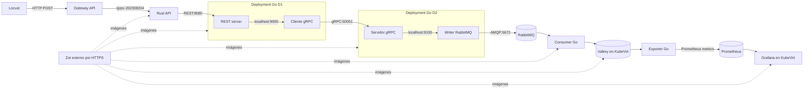
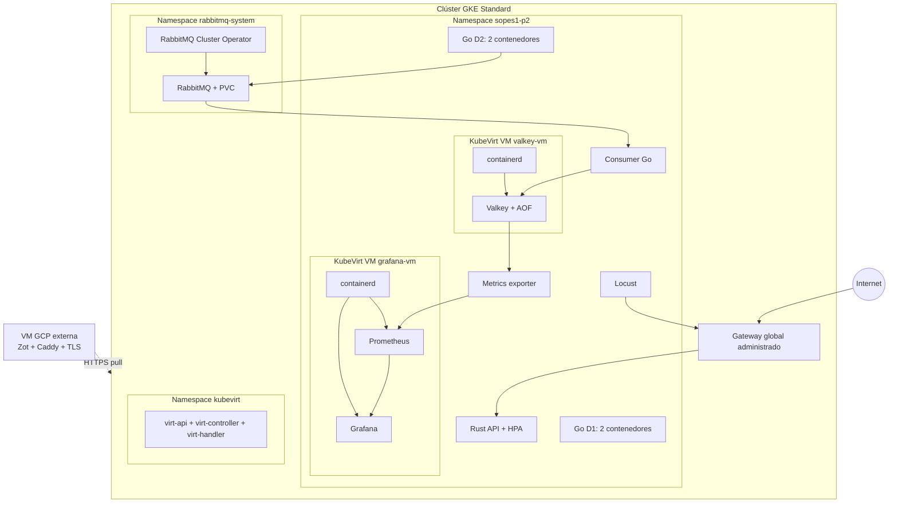
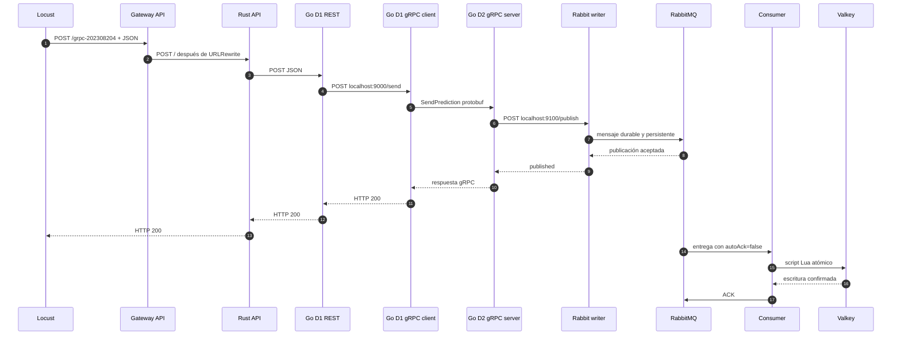
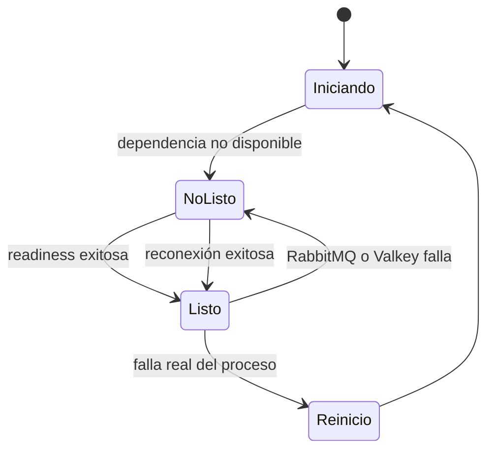

# Manual técnico — Q.M.2026.K8s

**Estudiante:** Isai Patzán · **Carnet:** 202308204  
**Curso:** Sistemas Operativos 1 · Vacaciones junio 2026

## 1. Objetivo

El sistema recibe predicciones del Mundial 2026, las valida, las transporta mediante REST,
gRPC y RabbitMQ, las persiste en Valkey y presenta métricas del equipo asignado, BRA, en
Grafana. La solución se ejecuta en GKE y usa KubeVirt para alojar Valkey y Grafana en VMs
independientes cuyos servicios se administran con containerd.

## 2. Arquitectura

```text
Locust
  │ POST /grpc-202308204
  ▼
Gateway API ──► Rust API (HPA 1–3, CPU 30%)
                    │ REST
                    ▼
               Go D1 Pod
             ┌─────────────┐
             │ REST server │──localhost──►│ gRPC client │
             └──────────────────────────────────────────┘
                                      │ gRPC
                                      ▼
                                 Go D2 Pod
                           ┌────────────────────┐
                           │ gRPC server        │
                           │ RabbitMQ writer    │
                           └─────────┬──────────┘
                                     │ AMQP
                                     ▼
                                  RabbitMQ
                                     │ ACK posterior al guardado
                                     ▼
                                 Go consumer
                                     │ RESP
                                     ▼
                  KubeVirt VM: Valkey sobre containerd
                                     │
                                     ▼
                           Go metrics exporter
                                     │ /metrics
                                     ▼
             KubeVirt VM: Prometheus + Grafana sobre containerd

Zot HTTPS (VM externa a GKE) ──► imágenes de todos los componentes
```



Los recursos de aplicación usan el namespace `sopes1-p2`. El operador y el servidor de
RabbitMQ usan `rabbitmq-system`, y KubeVirt usa `kubevirt`.

## 3. Contrato de datos

```json
{
  "home_team": "BRA",
  "away_team": "MEX",
  "home_goals": 2,
  "away_goals": 1,
  "username": "user_202308204",
  "timestamp": "2026-06-28T23:01:00Z"
}
```

Los equipos válidos son `GTM`, `MEX`, `BRA`, `ARG` y `ESP`; local y visitante deben ser
distintos. Los goles están entre 0 y 5 y el timestamp usa RFC 3339. El contrato gRPC se define
una sola vez en `proto/prediction.proto`.

## 4. Flujo completo

1. Locust genera predicciones aleatorias y las envía al Gateway.
2. El `HTTPRoute` reconoce `/grpc-202308204`, reemplaza el prefijo por `/` y dirige la
   solicitud a `rust-api-service`.
3. Rust valida el JSON y lo reenvía por REST a Go D1. Un error posterior se propaga como
   error HTTP; no se reporta un falso éxito.
4. El REST server de Go D1 llama por localhost al segundo contenedor del mismo Pod. El cliente
   transforma el mensaje al protobuf y llama a `SendPrediction` en Go D2.
5. El servidor gRPC de Go D2 transforma el protobuf a JSON y solicita al writer local la
   publicación AMQP.
6. El writer declara la cola durable `predictions` y publica mensajes persistentes.
7. El consumer usa `autoAck=false`; solo confirma el mensaje después de una escritura atómica
   exitosa en Valkey. Ante un fallo de Valkey realiza `NACK` con reencolado.
8. El exporter consulta Valkey y expone métricas Prometheus. Prometheus las recolecta y
   Grafana construye el dashboard BRA.

## 5. Gateway API

Se usa `GatewayClass gke-l7-global-external-managed`, un `Gateway` HTTP y un `HTTPRoute`; no
se utiliza Ingress. La política de health check consulta `/health` en Rust. El estado esperado
es `Programmed=True` para el Gateway y `Accepted=True`, `ResolvedRefs=True` para la ruta.

La dirección verificada el 28 de junio de 2026 fue `136.68.202.37`.

## 6. Servicios Go y RabbitMQ

Go D1 y Go D2 cumplen el requisito de dos contenedores por Deployment. La comunicación entre
Pods usa DNS de Services; la comunicación entre los dos contenedores de cada Pod usa localhost.
Todos poseen requests y limits.

RabbitMQ se instala con RabbitMQ Cluster Operator, una réplica y un PVC de 10 GiB. Las
credenciales provienen del Secret generado por el operador y se copian sin versionar valores
sensibles. La cola `predictions` es durable y al finalizar las pruebas mostró cero mensajes
pendientes, porque el consumer había confirmado todo lo persistido.

## 7. KubeVirt, containerd y persistencia

Los nodos destinados a las VMs tienen la etiqueta `nested-virtualization=enabled`. Las dos
VMs son recursos independientes:

| VM | Proceso administrado por containerd | Persistencia | Service |
|---|---|---|---|
| `valkey-vm` | Valkey 8 | PVC `valkey-data`, AOF | `valkey-service:6379` |
| `grafana-vm` | Grafana y Prometheus | PVC separados | `grafana-service:3000,9090` |

Cloud-init instala containerd y crea unidades systemd cuyo `ExecStart` usa `ctr run`. Las
imágenes se descargan de Zot por HTTPS. Valkey usa AOF con `appendfsync everysec`. Las series
recientes se acotan a 10,000 elementos para limitar crecimiento; los contadores y rankings
históricos se conservan.

La comprobación dentro del guest está registrada en
`evidence/runtime/20260628-containerd.md`. El acceso de diagnóstico usa una clave SSH generada
localmente en `.bin/`; la clave privada nunca se versiona.

## 8. Dashboard BRA

El flujo de observabilidad es `Valkey → go-metrics-exporter → Prometheus → Grafana`.
Prometheus es una capa de consulta; Valkey sigue siendo el almacenamiento obligatorio.

El dashboard contiene máximo y mínimo de goles local/visitante, modas, top de equipos por
victorias, top de usuarios, identificación de BRA, total de predicciones y evolución temporal
como local y visitante. Máximos, mínimos y modas usan hasta cinco registros del enfrentamiento
más reciente; rankings y total son históricos.

El JSON provisionable está en `infra/kubernetes/grafana/dashboards/quiniela-bra.json`.
La evidencia visual final está en `evidence/screenshots/dashboard-bra.png`.

## 9. HPA

El HPA de `rust-api` usa `minReplicas: 1`, `maxReplicas: 3` y objetivo promedio de CPU de 30%.
El Deployment define requests de CPU, requisito para que la utilización pueda calcularse.
La prueba automatizada observó el ciclo `1 → 3 → 1`.

Resultado guardado en `evidence/hpa/20260628T145848Z/RESULTADO.md`: 12,334 solicitudes,
6 errores (0.0486%), máximo de 3 réplicas y retorno a 1.

## 10. Pruebas de carga

La comparación reproducible mantiene Rust en una réplica para aislar la variable y ejecuta el
mismo escenario con Go D2 en una y dos réplicas.

| Métrica | Go D2: 1 réplica | Go D2: 2 réplicas |
|---|---:|---:|
| Requests/s | 112.62 | 113.99 |
| Promedio | 127.24 ms | 123.21 ms |
| p95 | 150 ms | 150 ms |
| p99 | 230 ms | 200 ms |
| Solicitudes | 6,653 | 6,733 |
| Errores | 0 | 0 |

Dos réplicas mejoraron 1.21% el throughput y redujeron ligeramente promedio y p99. Bajo esta
carga Go D2 no fue el cuello de botella: una réplica ya procesaba el tráfico disponible. La
evidencia fuente está en `evidence/locust/20260628T225747Z/`.

## 11. Zot e imágenes

Zot se ejecuta en una VM de GCP fuera de GKE y se publica por HTTPS como
`zot.35-226-224-23.sslip.io`. Las APIs, Locust, consumer, exporter, RabbitMQ, Valkey, Grafana,
Prometheus y el disco base de Ubuntu se consumen desde este registry. No se configura un
registry inseguro en los nodos.

El requisito de OCI Artifact fue dispensado verbalmente por el auxiliar. Como evidencia
adicional, el repositorio también permite publicar y descargar `prediction.proto` como
`sopes1/prediction-proto:v1` mediante `make artifact` y `make artifact-pull`.

## 12. Reproducibilidad

```bash
cd PROYECTO2
make test
make images
make artifact        # adicional; no requerido según indicación del auxiliar
make deploy
make validate
make load-test
make validate-hpa
```

El despliegue crea el Secret de cloud-init de Grafana desde una plantilla y genera una
contraseña aleatoria; no guarda credenciales en Git. El Secret de RabbitMQ también se obtiene
del operador.

## 13. Despliegue físico y lógico



La VM de Zot no pertenece al clúster. Esta separación demuestra que GKE consume imágenes de
un registry externo real. Dentro de GKE, las VMs de Valkey y Grafana se ejecutan en el node
pool con virtualización anidada; los demás Pods pueden programarse en el pool predeterminado.

## 14. Secuencia de una predicción



La respuesta HTTP confirma que RabbitMQ aceptó el evento, no que el dashboard ya se haya
actualizado. La persistencia posterior es asíncrona. Esta separación reduce la latencia del
productor y permite que RabbitMQ absorba diferencias temporales de velocidad.

## 15. Inventario de componentes y puertos

| Componente | Tipo | Puerto | Consumidor | Función |
|---|---|---:|---|---|
| Gateway | Gateway API | 80 | Locust/usuario | Entrada pública |
| Rust API | Deployment/Service | 8080/80 | Gateway | Validación y fachada REST |
| Go D1 REST | Contenedor | 8080 | Rust | Entrada al primer Pod Go |
| Go D1 gRPC client | Contenedor | 9000 | Go D1 REST | Conversión JSON a protobuf |
| Go D2 gRPC server | Contenedor/Service | 50051 | Go D1 client | Implementación de `SendPrediction` |
| Rabbit writer | Contenedor | 9100 | Go D2 server | Publicación AMQP |
| RabbitMQ | StatefulSet/Service | 5672 | Writer/consumer | Cola durable |
| RabbitMQ management | Service | 15672 | Administración | Interfaz de gestión |
| Consumer | Deployment | 8080 | Probes | Consumo y persistencia |
| Valkey | VM/Service | 6379 | Consumer/exporter | Datos procesados |
| Metrics exporter | Deployment/Service | 9100 | Prometheus | Traducción Valkey a métricas |
| Prometheus | Contenedor en VM | 9090 | Grafana | Recolección y consulta |
| Grafana | Contenedor en VM | 3000 | Evaluador | Dashboard BRA |

Los puertos 9000 y 9100 de los Pods multicontenedor no requieren Service porque solo se usan
por localhost dentro del mismo Pod.

## 16. Imágenes consumidas desde Zot

| Repositorio | Tag usado | Consumidor |
|---|---|---|
| `sopes1/rust-api` | `v3` | Rust API |
| `sopes1/go-d1-rest` | `v3` | Go D1 REST |
| `sopes1/go-d1-grpc-client` | `v3` | Go D1 client |
| `sopes1/go-d2-grpc-server` | `v2` | Go D2 server |
| `sopes1/go-d2-rabbit-writer` | `v4` | Rabbit writer |
| `sopes1/go-consumer` | `v2` | Consumer |
| `sopes1/go-metrics-exporter` | `v6` | Exporter |
| `sopes1/locust` | `v2` | Generador de carga |
| `library/rabbitmq` | `3.13-management` | RabbitMQCluster |
| `library/valkey` | `8-alpine` | containerd en `valkey-vm` |
| `library/grafana-oss` | `11.5.2` | containerd en `grafana-vm` |
| `library/prometheus` | `v2.55.1` | containerd en `grafana-vm` |
| `library/ubuntu-container-disk` | `24.04` | Disco base de ambas VMs |

La comprobación se realiza con `curl https://REGISTRY/v2/_catalog`, con los endpoints
`/v2/<repositorio>/tags/list` y con `make validate`. El 29 de junio de 2026 todos los
repositorios anteriores respondieron con sus tags esperados. Los Pods y cloud-init apuntan al
mismo dominio HTTPS; por ello la validación no se limita a comprobar que el catálogo exista,
sino que las cargas reales lograron descargar y ejecutar las imágenes.

## 17. Variables de entorno principales

| Componente | Variable | Valor o procedencia |
|---|---|---|
| Rust | `GO_D1_URL` | DNS de `go-d1-service` |
| Go D1 REST | `GRPC_CLIENT_URL` | `http://localhost:9000/send` |
| Go D1 client | `GO_D2_GRPC_ADDR` | `go-d2-service:50051` |
| Go D2 server | `RABBIT_WRITER_URL` | `http://localhost:9100/publish` |
| Writer | `RABBITMQ_HOST` | Service de RabbitMQ |
| Writer/consumer | `RABBITMQ_USER`, `RABBITMQ_PASSWORD` | Secret generado por el operador |
| Consumer | `VALKEY_ADDR` | `valkey-service:6379` |
| Consumer | `TIMESERIES_MAX_POINTS` | `10000` |
| Exporter | `VALKEY_ADDR` | `valkey-service:6379` |

Los nombres internos se resuelven mediante DNS de Kubernetes. No se fijan IPs de Pods, porque
cambian cuando Kubernetes los recrea.

## 18. Modelo de datos en Valkey

| Clave | Tipo | Uso |
|---|---|---|
| `stats:predictions:total` | String contador | Total global |
| `stats:wins` | Sorted set | Ranking histórico de victorias |
| `stats:users` | Sorted set | Ranking histórico de usuarios |
| `prediction:bra:count` | String contador | Total exacto asociado a BRA |
| `prediction:bra:recent` | Sorted set | Predicciones completas recientes |
| `prediction:bra:timeseries:local` | Sorted set | Evolución cuando BRA es local |
| `prediction:bra:timeseries:away` | Sorted set | Evolución cuando BRA es visitante |

El consumer ejecuta un script Lua para que contadores, rankings y series cambien como una sola
operación. Si esta operación falla, no se envía ACK y RabbitMQ reencola el mensaje. Las series
se recortan por rango para limitar el crecimiento; los contadores históricos no expiran.

## 19. Probes, recuperación y orden de arranque



- **Liveness** responde si el proceso sigue vivo y no debe depender de RabbitMQ o Valkey.
- **Readiness** indica si el contenedor puede atender correctamente y sí consulta dependencias.
- **Startup probe** protege al writer mientras RabbitMQ inicia después de encender los nodos.
- El exporter usa `/live` para liveness y `/health` para readiness; así no entra en reinicios
  durante el arranque de `valkey-vm`.
- `make deploy` espera las VMI y después comprueba Grafana 11.5.2, Prometheus y acceso anónimo.

## 20. Seguridad y manejo de secretos

- Zot usa HTTPS con certificado confiable; no se alteró containerd de los nodos para aceptar
  registries inseguros.
- Las credenciales de RabbitMQ nacen en el Secret del operador y se copian al namespace de la
  aplicación sin guardarlas en Git.
- La contraseña administrativa de Grafana se genera aleatoriamente dentro de la VM.
- Grafana permite acceso anónimo `Viewer`, suficiente para evaluación sin conceder edición.
- La clave SSH de diagnóstico de `grafana-vm` se genera bajo `.bin/`, carpeta ignorada por Git.
- Los Services internos son `ClusterIP`; únicamente el Gateway se expone públicamente.
- Los contenedores tienen requests y limits para planificación estable y cálculo del HPA.

## 21. Respuestas a preguntas técnicas

### ¿Por qué REST en la entrada y gRPC internamente?

REST/JSON facilita que Locust y cualquier cliente HTTP generen tráfico. gRPC aporta un contrato
tipado, serialización protobuf y llamadas eficientes entre servicios internos. La combinación
permite una frontera fácil de consumir y una integración interna estricta.

### ¿Por qué RabbitMQ si ya existe gRPC?

gRPC es síncrono: el emisor espera una respuesta. RabbitMQ desacopla publicación y consumo,
amortigua picos y conserva mensajes mientras el consumer se recupera. No reemplaza gRPC; cada
tecnología resuelve una parte diferente del flujo.

### ¿Qué garantiza que no se pierda una predicción?

La cola y el mensaje son persistentes, y el consumer usa confirmación manual. El ACK ocurre
solo después de la transacción Lua exitosa en Valkey. Esto ofrece entrega al menos una vez; en
un fallo extremo puede haber repetición, por lo que una evolución futura podría añadir una
clave de idempotencia.

### ¿Por qué Prometheus entre Valkey y Grafana?

Grafana no debe conocer el modelo interno de Valkey. El exporter transforma las claves en
métricas con nombres y labels estables; Prometheus las recolecta y Grafana consulta PromQL.
Esto reduce acoplamiento y hace observable el sistema con herramientas estándar.

### ¿Por qué Valkey y Grafana se ejecutan en VMs de KubeVirt?

Es una exigencia del proyecto y demuestra virtualización anidada: Kubernetes administra el
ciclo de vida de una VM, mientras containerd administra procesos aislados dentro del guest.
Así se practican simultáneamente orquestación de contenedores y virtualización.

### ¿Por qué dos contenedores en Go D1 y Go D2?

El enunciado solicita separar responsabilidades dentro de cada Pod. Los contenedores que deben
compartir ciclo de vida y red se comunican por localhost, pero conservan imágenes, procesos y
probes independientes.

### ¿Por qué dos réplicas de Go D2 casi no aumentaron el throughput?

El experimento obtuvo apenas 1.21% adicional. La carga, el Gateway, Rust, RabbitMQ o la latencia
de red limitaron antes de saturar una réplica de Go D2. Escalar un componente no mejora el
resultado si ese componente no es el cuello de botella.

### ¿Por qué el HPA necesita requests de CPU?

El porcentaje objetivo se calcula respecto al request de CPU. Sin request Kubernetes no tiene
una base para interpretar 30% y el HPA mostraría métricas desconocidas.

## 22. Operación, fallos comunes y diagnóstico

| Síntoma | Causa probable | Acción |
|---|---|---|
| Pods `Pending` | Node pools en cero | Encender los pools y esperar nodos `Ready` |
| `connection refused` a Grafana al inicio | cloud-init aún instala paquetes | Esperar `make deploy`; no interrumpirlo |
| `ImagePullBackOff` | tag ausente o Zot/TLS inaccesible | Consultar tags y `curl https://.../v2/` |
| HTTP 502 público | Go D1/Go D2 no disponible | Revisar logs en orden Rust → D1 → D2 |
| Cola crece | Consumer o Valkey no disponible | Revisar readiness, logs y VMI |
| HPA muestra `<unknown>` | metrics-server o requests faltantes | Verificar HPA y recursos del Deployment |
| `localhost:3000` muestra otro Grafana | Contenedor local ocupa el puerto | Usar túnel KubeVirt en `localhost:13000` |
| `kubectl logs -f` no devuelve el prompt | Es modo seguimiento | Usar otra terminal o `--tail=20` |

## 23. Evidencias y trazabilidad

| Evidencia | Ubicación |
|---|---|
| Dashboard final | `evidence/screenshots/dashboard-bra.png` |
| Runtime containerd | `evidence/runtime/20260628-containerd.md` |
| Comparación Go D2 | `evidence/locust/20260628T225747Z/` |
| Ciclo HPA | `evidence/hpa/20260628T145848Z/` |
| Dashboard provisionable | `infra/kubernetes/grafana/dashboards/quiniela-bra.json` |
| Comandos de evaluación | `docs/GuiaCalificacion.md` |
| Auditoría de requisitos | `docs/AuditoriaRequisitos.md` |

## 24. Conclusiones

- El flujo obligatorio fue validado extremo a extremo con REST, gRPC, AMQP y persistencia.
- Los ACK posteriores al guardado evitan perder mensajes cuando Valkey falla temporalmente.
- KubeVirt permite mantener Valkey y Grafana aislados en VMs sin abandonar la administración
  declarativa de Kubernetes.
- El HPA respondió a carga real y volvió a su mínimo tras el enfriamiento.
- Duplicar Go D2 no produjo una mejora material con 50 usuarios; escalar debe responder a una
  medición, no asumirse como beneficio automático.
- Dapr y k3s no se implementaron porque corresponden a punteo opcional.
