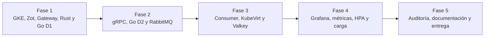
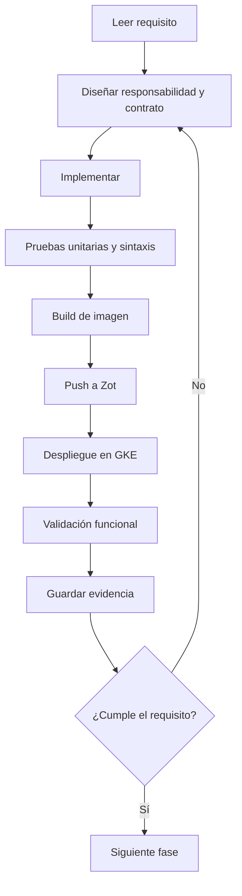

# Metodología

El proyecto se desarrolló incrementalmente en cinco fases: infraestructura, mensajería,
persistencia, observabilidad y entrega. Cada fase se consideró completa únicamente después de
compilar, publicar sus imágenes en Zot, desplegar en GKE y obtener una prueba funcional.

Se aplicaron estos criterios:

1. **Contrato único:** `prediction.proto` es la fuente compartida entre cliente y servidor.
2. **Fallo visible:** cada capa propaga errores; una dependencia caída no produce HTTP 200.
3. **Entrega confiable:** RabbitMQ usa mensajes persistentes y el consumer confirma después de
   persistir en Valkey.
4. **Infraestructura declarativa:** Kubernetes, Gateway API, HPA y VMs se describen en YAML y
   se ensamblan con Kustomize.
5. **Secretos fuera de Git:** las credenciales se generan o sincronizan durante el despliegue.
6. **Medición reproducible:** scripts automatizan pruebas unitarias, carga 1 vs. 2 réplicas y
   el ciclo del HPA.
7. **Evidencia:** CSV, reportes HTML y resúmenes Markdown quedan en `evidence/`.

La comparación de rendimiento cambió únicamente la cantidad de réplicas de Go D2; Rust se
mantuvo fijo para evitar mezclar variables. La prueba del HPA se ejecutó por separado. Esta
separación permite atribuir los resultados observados al componente evaluado.

## Ciclo aplicado en cada fase

## Estrategia de validación

La validación se hizo en capas para localizar fallos con rapidez:

1. **Estática:** sintaxis, render Kustomize, JSON del dashboard y ausencia de secretos.
2. **Unitaria:** pruebas Go y Rust de validación, errores posteriores y transformación.
3. **Integración:** comunicación REST, gRPC, AMQP, Valkey y exporter.
4. **Infraestructura:** Pods, Services, VMI, Gateway, HPA, PVC y catálogo Zot.
5. **Extremo a extremo:** POST público, cola procesada y dashboard actualizado.
6. **Rendimiento:** carga repetible y modificación de una sola variable experimental.
7. **Recuperación:** dependencias temporalmente ausentes, readiness y reconexión.

## Criterios de decisión

- Se prefirió DNS de Services sobre IPs efímeras.
- Se usó localhost solo entre contenedores del mismo Pod.
- Se conservaron errores en vez de transformarlos en falsos HTTP 200.
- Se confirmó RabbitMQ únicamente después de persistir.
- Se separó liveness de readiness para no reiniciar procesos sanos.
- Se fijaron versiones de imágenes para reproducibilidad.
- Se documentaron las partes opcionales no implementadas para delimitar el alcance.

## Control de cambios y evidencia

Los scripts de `Makefile` actúan como interfaz estable. Los resultados de carga y HPA se
guardan en carpetas con timestamp, evitando reemplazar evidencia anterior. Los manifiestos,
scripts y manuales se mantienen en Git; credenciales, claves privadas y binarios auxiliares se
excluyen.
