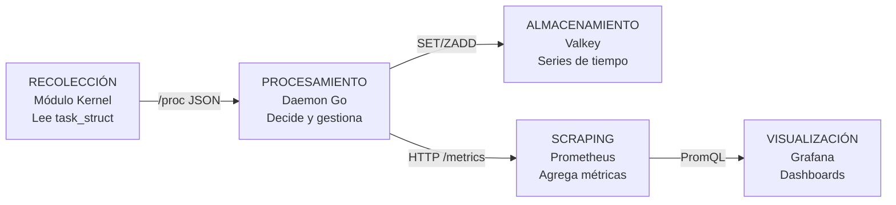
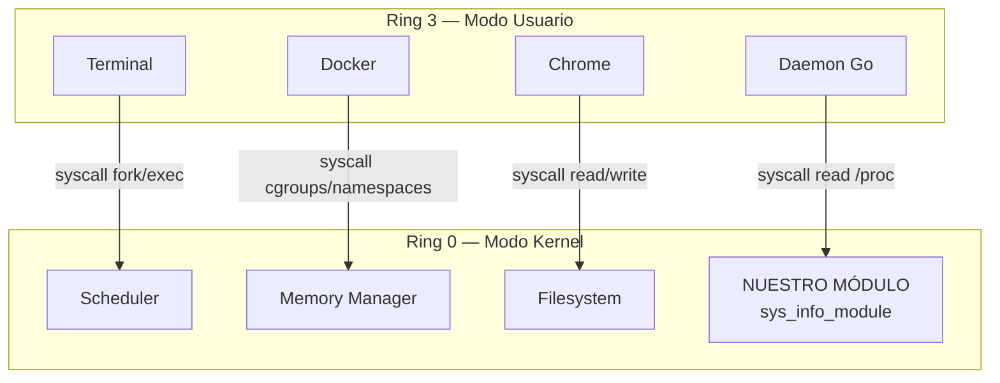
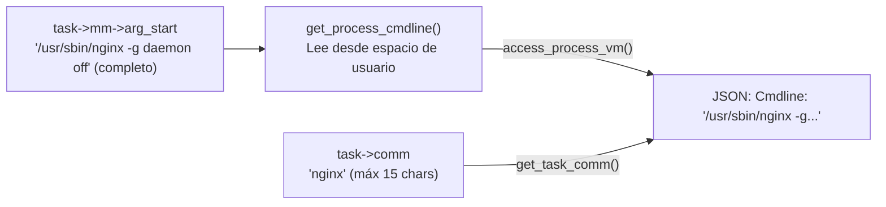
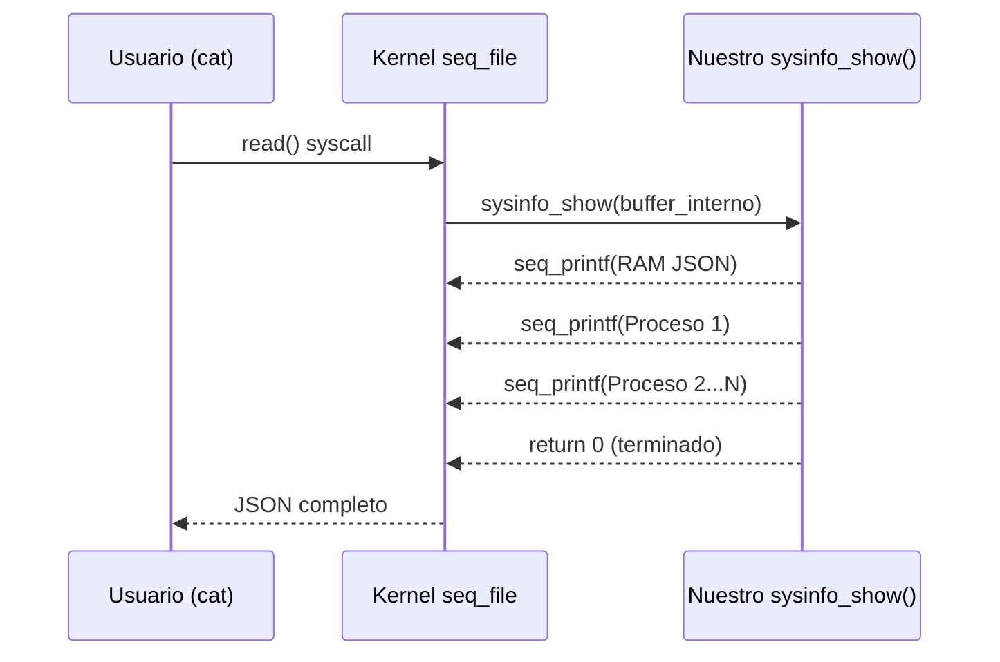
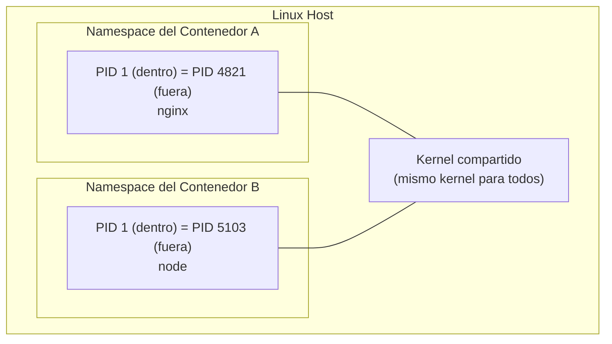
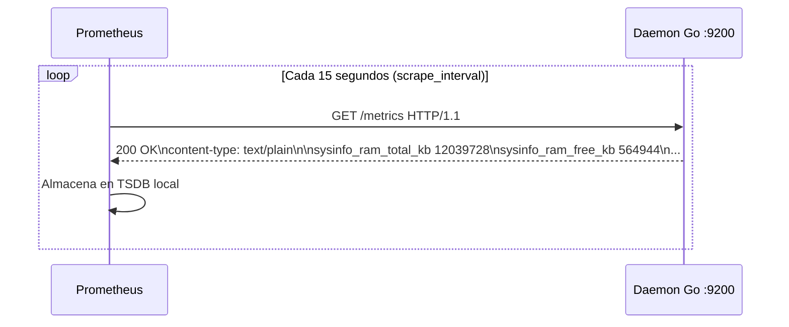
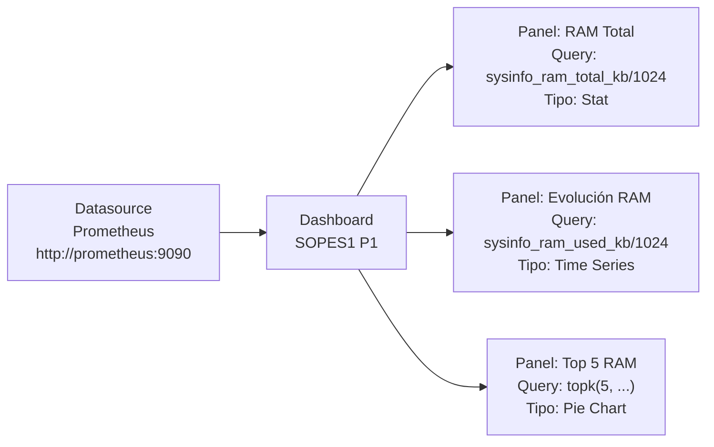
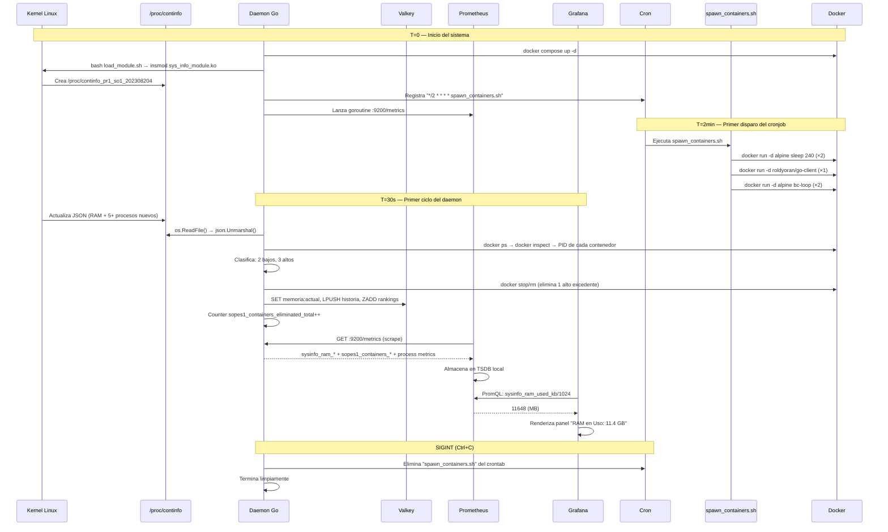

# Guía de Aprendizaje Completa — Proyecto 1 SOPES 1
**Sonda de Kernel en C y Daemon en Go para Telemetría de Contenedores**
Universidad San Carlos de Guatemala · Sistemas Operativos 1 · Vacaciones Junio 2026

> Esta guía explica desde cero cada tecnología, concepto y decisión de diseño del proyecto.
> Al terminarla deberías poder explicar cualquier parte del sistema en una defensa oral.

---

## Tabla de Contenidos

1. [El Gran Cuadro — ¿Qué construimos?](#1-el-gran-cuadro--qué-construimos)
2. [Concepto 1: El Kernel de Linux y los Módulos LKM](#2-concepto-1-el-kernel-de-linux-y-los-módulos-lkm)
3. [Concepto 2: El Sistema de Archivos /proc](#3-concepto-2-el-sistema-de-archivos-proc)
4. [Concepto 3: task_struct — El ADN de un Proceso](#4-concepto-3-task_struct--el-adn-de-un-proceso)
5. [Concepto 4: Memoria Virtual vs Física (VSZ y RSS)](#5-concepto-4-memoria-virtual-vs-física-vsz-y-rss)
6. [Concepto 5: Sincronización con RCU](#6-concepto-5-sincronización-con-rcu)
7. [Concepto 6: seq_file — Cómo Escribir en /proc](#7-concepto-6-seq_file--cómo-escribir-en-proc)
8. [Concepto 7: Contenedores Docker desde Adentro](#8-concepto-7-contenedores-docker-desde-adentro)
9. [Concepto 8: El Daemon en Go — Diseño del Corazón](#9-concepto-8-el-daemon-en-go--diseño-del-corazón)
10. [Concepto 9: Valkey como Base de Datos de Series de Tiempo](#10-concepto-9-valkey-como-base-de-datos-de-series-de-tiempo)
11. [Concepto 10: Prometheus — El Modelo Pull de Métricas](#11-concepto-10-prometheus--el-modelo-pull-de-métricas)
12. [Concepto 11: Grafana y la Visualización de Métricas](#12-concepto-11-grafana-y-la-visualización-de-métricas)
13. [Concepto 12: Cron y la Automatización de Tareas](#13-concepto-12-cron-y-la-automatización-de-tareas)
14. [El Flujo Completo Integrado](#14-el-flujo-completo-integrado)
15. [Decisiones de Diseño y Por Qué](#15-decisiones-de-diseño-y-por-qué)
16. [Preguntas de Defensa y Respuestas](#16-preguntas-de-defensa-y-respuestas)

---

## 1. El Gran Cuadro — ¿Qué construimos?

Construimos un sistema de **observabilidad** de contenedores. La observabilidad es la capacidad de entender el estado interno de un sistema desde el exterior, mirando sus salidas. Este proyecto implementa el patrón completo:



Este patrón (recolección → procesamiento → almacenamiento → visualización) es exactamente el que usan herramientas industriales como el stack ELK (Elasticsearch, Logstash, Kibana) o el stack Prometheus + Grafana que usamos aquí.

**Lo que lo hace único:** la recolección ocurre en **kernel space** (modo privilegiado), algo que herramientas como `ps` o `docker stats` no pueden hacer de forma tan directa. Tenemos acceso a las estructuras internas del kernel.

---

## 2. Concepto 1: El Kernel de Linux y los Módulos LKM

### ¿Qué es el kernel?

El kernel es el núcleo del sistema operativo. Es el único software que corre en **modo privilegiado** (también llamado Ring 0 en x86), con acceso directo al hardware: CPU, RAM, discos, red. Todo lo demás (tu navegador, tu terminal, el daemon Go) corre en **modo usuario** (Ring 3) y debe pedirle al kernel que haga operaciones privilegiadas a través de llamadas al sistema (syscalls).



### ¿Qué es un LKM (Loadable Kernel Module)?

Un LKM es código C que puedes insertar en el kernel **sin reiniciar el sistema**. Es como un plugin para el kernel. Cuando lo cargas con `insmod`, tu código pasa a correr en Ring 0 con acceso total al hardware.

### Las dos funciones obligatorias

Todo módulo debe tener exactamente estas dos funciones:

```c
// Se ejecuta al cargar: sudo insmod modulo.ko
static int __init sysinfo_init(void) {
    // Crear el archivo /proc, registrar interrupciones, etc.
    return 0;  // 0 = éxito
}

// Se ejecuta al descargar: sudo rmmod modulo
static void __exit sysinfo_exit(void) {
    // Limpiar todo lo que creamos en init
}

module_init(sysinfo_init);  // Registrar las funciones
module_exit(sysinfo_exit);
MODULE_LICENSE("GPL");       // Obligatorio para acceder a símbolos del kernel
```

### ¿Por qué `MODULE_LICENSE("GPL")`?

El kernel Linux exporta miles de funciones que los módulos pueden usar. Algunas de estas funciones están marcadas como `EXPORT_SYMBOL_GPL` — solo disponibles para módulos con licencia GPL. Sin esta declaración, el compilador rechazaría el acceso a funciones como `proc_create`, `task_struct` y `si_meminfo`.

### El Makefile del módulo

El sistema de compilación del kernel es especial:

```makefile
obj-m += sys_info_module.o     # "obj-m" = objeto módulo (no integrado al kernel)
KDIR := /lib/modules/$(shell uname -r)/build   # Headers del kernel actual

all:
    $(MAKE) -C $(KDIR) M=$(PWD) modules
    # -C $(KDIR) = "entra al directorio del kernel"
    # M=$(PWD)   = "pero compila los módulos de ESTE directorio"
```

La clave es que usamos el **sistema de build del propio kernel** para asegurar compatibilidad exacta. Si compilas el módulo con un kernel diferente al que está corriendo, el `insmod` falla con "invalid module format".

---

## 3. Concepto 2: El Sistema de Archivos /proc

### ¿Qué es /proc?

`/proc` es un **sistema de archivos virtual**. No existe en ningún disco — el kernel lo genera en RAM y lo presenta como si fueran archivos. Es el mecanismo estándar de comunicación entre el kernel y el espacio de usuario.

```bash
# Archivos /proc que ya existen en cualquier Linux:
cat /proc/cpuinfo          # Detalles de cada núcleo de CPU
cat /proc/meminfo          # Estado detallado de la memoria RAM
cat /proc/uptime           # Segundos desde que arrancó el sistema
cat /proc/1/status         # Estado del proceso con PID 1 (systemd)
cat /proc/self/maps        # Mapa de memoria del proceso actual
```

### ¿Por qué /proc y no un socket o una pipe?

`/proc` tiene ventajas únicas:

- **Universalidad:** cualquier programa puede leer archivos — no necesita una API especial.
- **Herramientas existentes:** `cat`, `grep`, `python3`, `curl` funcionan directamente.
- **Sin estado:** cada lectura genera los datos frescos desde el kernel.
- **Seguridad:** los permisos del archivo controlan quién puede leer qué.

### Cómo creamos nuestro archivo /proc

```c
#include <linux/proc_fs.h>   // proc_create()
#include <linux/seq_file.h>  // seq_file, single_open()

// 1. Definir qué hacer cuando alguien lee el archivo
static int sysinfo_show(struct seq_file *m, void *v) {
    seq_printf(m, "{ \"clave\": \"valor\" }");  // Escribir al buffer
    return 0;
}

// 2. Función de apertura 
static int sysinfo_open(struct inode *inode, struct file *file) {
    return single_open(file, sysinfo_show, NULL);
    // single_open maneja toda la complejidad de seq_file internamente
}

// 3. Tabla de operaciones (qué función llamar para cada syscall)
static const struct proc_ops sysinfo_ops = {
    .proc_open    = sysinfo_open,  // cuando alguien hace open()
    .proc_read    = seq_read,      // cuando alguien hace read()
    .proc_lseek   = seq_lseek,     // para posicionamiento
    .proc_release = single_release, // cuando se cierra el archivo
};

// 4. En el init del módulo, registrar el archivo
proc_create("continfo_pr1_so1_202308204", 0444, NULL, &sysinfo_ops);
// nombre, permisos (0444=lectura para todos), directorio padre, operaciones

// 5. En el exit, eliminarlo
remove_proc_entry("continfo_pr1_so1_202308204", NULL);
```

### ¿Qué hace `seq_printf`?

Es el equivalente de `printf` para el kernel. No escribe a `stdout` sino a un buffer interno de `seq_file` que el kernel entrega al usuario cuando hace `read()`. Esto resuelve automáticamente el problema de generar datos más grandes que el buffer (el kernel llama a `sysinfo_show` múltiples veces si es necesario).

---

## 4. Concepto 3: task_struct — El ADN de un Proceso

### La estructura más importante del kernel

Cada proceso que existe en Linux (incluyendo threads) tiene exactamente una instancia de `task_struct` en memoria. Esta estructura contiene **todo** lo que el kernel sabe sobre ese proceso:

```c
// Campos relevantes de task_struct (simplificado)
struct task_struct {
    // Identidad
    pid_t           pid;        // ID único del proceso
    pid_t           tgid;       // ID del grupo de threads (PID del proceso padre)
    char            comm[16];   // Nombre corto (máximo 15 caracteres + '\0')

    // Memoria
    struct mm_struct *mm;       // Espacio de direcciones virtuales
                                // NULL para threads del kernel

    // Tiempo de CPU (en nanosegundos)
    u64             utime;      // Tiempo en modo usuario
    u64             stime;      // Tiempo en modo kernel

    // Estado
    long            state;      // TASK_RUNNING, TASK_INTERRUPTIBLE, etc.

    // Relaciones
    struct task_struct *parent; // Proceso padre
    struct list_head children;  // Lista de hijos

    // ... y cientos de campos más
};
```

### Iterar sobre todos los procesos

El kernel mantiene una lista circular doblemente enlazada de todos los procesos. Para iterar de forma segura:

```c
struct task_struct *task;

rcu_read_lock();                    // Protección necesaria (ver Concepto 5)
for_each_process(task) {            // Macro que itera la lista
    printk(KERN_INFO "PID=%d, Nombre=%s\n", task->pid, task->comm);
}
rcu_read_unlock();
```

### ¿Por qué `task->comm` y no el nombre completo?

`comm` solo guarda los primeros 15 caracteres del nombre del ejecutable. Para el nombre completo (con argumentos), necesitamos leer el **cmdline** del proceso, que está en su espacio de memoria de usuario. Por eso usamos `get_process_cmdline()`, que accede a `mm->arg_start` con `access_process_vm()`.



---

## 5. Concepto 4: Memoria Virtual vs Física (VSZ y RSS)

### El engaño de la memoria virtual

Cada proceso en Linux cree que tiene toda la RAM para él solo. Esto es una ilusión creada por el kernel: el **espacio de direcciones virtuales**. El kernel traduce silenciosamente cada dirección virtual a una física real.

```
Proceso A cree que usa:    0x0000 → 0xFFFF (todo el espacio)
Proceso B también cree:    0x0000 → 0xFFFF (mismo espacio virtual)

Realidad física:
  Páginas de A → RAM física: 0x1A000, 0x3F000, 0x7B000...
  Páginas de B → RAM física: 0x2C000, 0x5D000, 0x8E000...
```

### VSZ (Virtual Size) — El espacio reservado

VSZ es todo el espacio de direcciones virtuales que el proceso tiene **mapeado** (reservado), incluso si nunca ha accedido a él. Incluye:

- El código del programa
- Las bibliotecas compartidas (.so)
- El heap (aunque no esté completamente usado)
- Archivos mapeados en memoria (`mmap`)
- Memoria reservada pero no asignada (lazy allocation)

```c
// Obtener VSZ desde el kernel
unsigned long vsz_kb = task->mm->total_vm << (PAGE_SHIFT - 10);
// total_vm = número de páginas virtuales mapeadas
// PAGE_SHIFT = 12 en x86-64 (páginas de 4096 bytes = 2^12)
// << (12-10) = << 2 = × 4 = convierte páginas a KB (4096 bytes / 1024 = 4 KB/página)
```

### RSS (Resident Set Size) — Lo que realmente está en RAM

RSS es solo las páginas que están **actualmente en RAM física**. Las páginas que fueron intercambiadas al disco swap o que nunca se accedieron no cuentan.

```c
// Obtener RSS desde el kernel
unsigned long rss_kb = get_mm_rss(task->mm) << (PAGE_SHIFT - 10);
// get_mm_rss() cuenta las páginas físicas reales del proceso
```

### Por qué VSZ > RSS siempre

Un proceso puede reservar 1 GB de heap pero solo haber escrito en 50 MB. VSZ = 1 GB, RSS = 50 MB. Cuando el sistema tiene poca memoria y el kernel necesita liberar páginas, puede sacar algunas páginas de RAM al disco (swap), reduciendo el RSS sin cambiar el VSZ.

```
Proceso Java típico:
  VSZ = 4 GB  (toda la memoria que la JVM reservó)
  RSS = 400 MB  (lo que realmente está en RAM ahora)
```

---

## 6. Concepto 5: Sincronización con RCU

### El problema de concurrencia

Imagina que estás iterando la lista de procesos con `for_each_process` y en exactamente ese momento, en otra CPU, un proceso termina y el kernel libera su `task_struct`. Tu código intenta leer memoria que ya no existe → **kernel panic**.

### La solución: Read-Copy-Update (RCU)

RCU es un mecanismo de sincronización del kernel diseñado para lecturas frecuentes y escrituras raras. La idea: los lectores nunca se bloquean; las escrituras esperan a que ningún lector esté activo antes de liberar memoria.

```c
rcu_read_lock();    // "Entro a sección de lectura RCU"
                    // El kernel garantiza que ningún task_struct
                    // será liberado mientras estemos aquí

for_each_process(task) {
    // Acceso seguro a task_struct
    // El kernel NO puede liberar este proceso
    // aunque haya terminado mientras leemos
}

rcu_read_unlock();  // "Salgo de sección de lectura RCU"
                    // El kernel puede proceder a liberar
                    // cualquier task_struct que esperaba
```

### ¿Por qué no usar un mutex normal?

Un mutex (`lock/unlock`) bloquearía el scheduler mientras leemos los procesos — ningún proceso nuevo podría crearse o terminar. En un sistema de producción, esto causaría latencias inaceptables. RCU permite que el sistema siga funcionando con normalidad durante nuestra lectura.

---

## 7. Concepto 6: seq_file — Cómo Escribir en /proc

### El problema de los buffers

Cuando el usuario hace `cat /proc/mi_archivo`, el kernel llama a nuestra función de lectura. ¿Qué pasa si tenemos 500 procesos y el JSON resultante es mayor que un solo buffer del kernel (generalmente 4 KB)?

`seq_file` resuelve esto automáticamente. Internamente:

1. Llama a tu función `show()` con un buffer interno.
2. Si el buffer se llena, lo entrega al usuario y llama a `show()` de nuevo desde donde se quedó.
3. Repite hasta que `show()` retorne 0 (terminado).

Esto es transparente para nosotros — simplemente usamos `seq_printf()` como si fuera `printf()`.



---

## 8. Concepto 7: Contenedores Docker desde Adentro

### ¿Qué es realmente un contenedor?

Un contenedor Docker **no es una máquina virtual**. Es un proceso (o grupo de procesos) en tu Linux que vive en un entorno aislado gracias a dos características del kernel:

- **Namespaces:** aíslan lo que el proceso puede *ver* (procesos, red, filesystem, usuarios).
- **cgroups (Control Groups):** limitan los recursos que el proceso puede *usar* (CPU, RAM, disco).



### ¿Por qué nuestro módulo ve los procesos de los contenedores?

Porque `for_each_process(task)` itera **todos** los procesos del sistema, incluyendo los que están dentro de contenedores. Los namespaces solo afectan lo que cada proceso *ve*, no lo que el kernel sabe.

Desde el kernel, el proceso principal de un contenedor es simplemente otro `task_struct` más. Su PID dentro del contenedor puede ser 1, pero su PID real (en el host) es otro número. `task->pid` nos da el PID del host.

### El comando que clasifica contenedores

```bash
docker ps --filter "name=sopes1_" --format "{{.ID}}|{{.Names}}|{{.Image}}|{{.Command}}"
```

Filtramos por el prefijo `sopes1_` (que nuestro script siempre usa) para no tocar Grafana, Prometheus ni Valkey.

```bash
docker inspect --format "{{.State.Pid}}" CONTAINER_ID
```

Esto nos da el PID real (en el host) del proceso principal del contenedor. Con ese PID podemos buscar en la lista de procesos de `/proc` para obtener su RSS, CPU, VSZ.

---

## 9. Concepto 8: El Daemon en Go — Diseño del Corazón

### ¿Qué es un daemon?

Un daemon es un proceso que corre en segundo plano de forma indefinida, sin interfaz de usuario, esperando eventos o ejecutando tareas periódicas. El servidor web nginx, el servidor SSH, cron — todos son daemons.

### El patrón select + ticker + signal

El loop principal del daemon usa el patrón idiomático de Go para tareas periódicas con apagado limpio:

```go
// Canal de señales del SO (Ctrl+C, systemctl stop)
sigChan := make(chan os.Signal, 1)
signal.Notify(sigChan, syscall.SIGTERM, syscall.SIGINT)

// Ticker que "toca" cada 30 segundos
ticker := time.NewTicker(30 * time.Second)
defer ticker.Stop()

for {
    select {
    case <-ticker.C:       // Cada 30 segundos
        ejecutarCiclo()    // Hacer el trabajo real

    case sig := <-sigChan: // Cuando llega Ctrl+C o SIGTERM
        log.Printf("Señal: %v. Limpiando...", sig)
        limpiarAlSalir()   // Eliminar cronjob
        return             // Terminar el goroutine main
    }
}
```

El `select` espera el primer canal que tenga datos disponibles. Si llegan al mismo tiempo, elige aleatoriamente. Esto garantiza que el apagado es siempre limpio, sin importar cuándo llegue la señal.

### Goroutines: concurrencia sin complejidad

El servidor de métricas Prometheus corre en paralelo al loop principal sin bloquearlo:

```go
func iniciarServidorMetricas() {
    // ...
    go func() {   // "go" = lanzar goroutine
        srv.ListenAndServe()  // Esta llamada bloquea
    }()
    // El código aquí continúa inmediatamente
    // La goroutine corre en paralelo
}
```

Go maneja miles de goroutines sin el overhead de threads del sistema operativo. Son goroutines livianas multiplexadas sobre unos pocos threads del OS.

### El patrón Collector de Prometheus

Nuestro `SysInfoCollector` implementa `prometheus.Collector`, que define un protocolo de dos métodos:

```go
type SysInfoCollector struct { /* descriptores de métricas */ }

// Describe: llamado una vez al registrar, declara qué métricas existen
func (c *SysInfoCollector) Describe(ch chan<- *prometheus.Desc) {
    ch <- c.totalRAM
    // ...
}

// Collect: llamado en CADA scrape de Prometheus
func (c *SysInfoCollector) Collect(ch chan<- prometheus.Metric) {
    info, _ := leerProcFile()  // Leer datos frescos del kernel
    ch <- prometheus.MustNewConstMetric(c.totalRAM, prometheus.GaugeValue, float64(info.TotalRAM))
    // ...
}
```

Esto garantiza que cada vez que Prometheus pide las métricas, recibe datos frescos de `/proc` en ese instante exacto, no un caché.

---

## 10. Concepto 9: Valkey como Base de Datos de Series de Tiempo

### ¿Qué es Valkey?

Valkey es un fork open-source de Redis (Linux Foundation, 2024). Es una base de datos **en memoria** del tipo clave-valor, extremadamente rápida porque todo vive en RAM. Compatible con todos los clientes Redis.

### Tipos de datos que usamos

**String:** Para el estado actual (se sobreescribe en cada ciclo):
```
SET memoria:actual '{"total_kb":12039728, "libre_kb":564944, "timestamp":1780862866}'
GET memoria:actual → devuelve el JSON del último ciclo
```

**List (lista):** Para historial (LPUSH inserta al inicio, LRANGE lee rangos):
```
LPUSH memoria:historia '{"total_kb":..., "timestamp":T1}'
LPUSH memoria:historia '{"total_kb":..., "timestamp":T2}'
LRANGE memoria:historia 0 9   → últimos 10 snapshots (T2 primero, T1 después)
LTRIM memoria:historia 0 999  → mantener máximo 1000 entradas
```

**Sorted Set (conjunto ordenado):** Para rankings (ZADD con score numérico):
```
ZADD ranking:ram 700000 "grafana"     # score=700MB RSS
ZADD ranking:ram 592000 "chrome"
ZADD ranking:ram 541000 "code"
ZREVRANGE ranking:ram 0 4 WITHSCORES  → top 5 de mayor a menor RSS
```

**Counter (Incr):** Para el total de eliminaciones:
```
INCR eliminados:total   → autoincremento atómico (seguro para concurrencia)
GET eliminados:total    → número actual
```

### ¿Por qué no solo Prometheus para todo?

Prometheus es excelente para métricas numéricas de series de tiempo, pero Valkey nos permite:
- Guardar **logs estructurados** (JSON de cada eliminación)
- Mantener **rankings persistentes** que sobreviven reinicios
- Almacenar datos que Grafana puede consultar directamente sin necesidad de Prometheus

---

## 11. Concepto 10: Prometheus — El Modelo Pull de Métricas

### Pull vs Push

La mayoría de sistemas de monitoreo usan **push**: las aplicaciones envían métricas a un servidor central. Prometheus usa el modelo contrario, **pull**: Prometheus visita periódicamente a cada aplicación y le pide sus métricas.



### El formato de métricas (text/plain)

```
# HELP sysinfo_ram_total_kb RAM total en KB
# TYPE sysinfo_ram_total_kb gauge
sysinfo_ram_total_kb 12039728
# HELP sysinfo_process_rss_kb RSS del proceso en KB
# TYPE sysinfo_process_rss_kb gauge
sysinfo_process_rss_kb{pid="1234",name="grafana",cmdline="/usr/share/grafana/bin/grafana"} 716800
sysinfo_process_rss_kb{pid="5678",name="chrome",cmdline="/usr/bin/google-chrome"} 606208
```

### PromQL — El lenguaje de consulta

PromQL es como SQL pero para series de tiempo. Algunos ejemplos:

```promql
# Valor instantáneo (último punto)
sysinfo_ram_used_kb / 1024

# Porcentaje calculado
sysinfo_ram_used_kb / sysinfo_ram_total_kb * 100

# Top 5 por valor máximo, agrupado por nombre de proceso
topk(5, max by (name) (sysinfo_process_rss_kb))

# Tasa de cambio: cuántos se eliminaron en los últimos 2 minutos
increase(sopes1_containers_eliminated_total[2m])
```

### Tipos de métricas

| Tipo | Descripción | Ejemplo en el proyecto |
|---|---|---|
| **Gauge** | Valor que sube y baja | `sysinfo_ram_used_kb`, `sopes1_active_containers_alto` |
| **Counter** | Solo sube (se reinicia si el proceso reinicia) | `sopes1_containers_eliminated_total` |
| **Histogram** | Distribución de valores | (no usamos en este proyecto) |
| **Summary** | Percentiles | (no usamos en este proyecto) |

---

## 12. Concepto 11: Grafana y la Visualización de Métricas

### Datasource → Panel → Query



### Instant vs Range queries

- **Instant:** un solo punto de tiempo (ahora). Usada en Stat y Gauge.
- **Range:** serie de puntos en el tiempo. Usada en Time Series y Pie Chart de histórico.

En el dashboard, los paneles de la fila superior (RAM Total, RAM en Uso, Memoria Libre, % RAM Usada) usan queries **instant** para mostrar el valor actual. Los paneles de la fila media (gráficas de tiempo) usan queries **range** para mostrar la evolución.

### ¿Por qué `max by (name)` en los Pie Charts?

El módulo reporta métricas con labels `{pid, name, cmdline}`. Un mismo proceso puede tener múltiples PIDs (threads). Sin `max by (name)`, Grafana mostraría múltiples entradas para `chrome` con diferentes PIDs. Con `max by (name)`, colapsa todos los PIDs del mismo proceso en un solo valor (tomando el máximo).

---

## 13. Concepto 12: Cron y la Automatización de Tareas

### La sintaxis crontab explicada

```
# ┌───── minutos (0-59)
# │ ┌─── horas (0-23)
# │ │ ┌─── día del mes (1-31)
# │ │ │ ┌─── mes (1-12)
# │ │ │ │ ┌─── día de semana (0=domingo, 7=domingo)
# │ │ │ │ │
  * * * * *  comando

# Nuestro cronjob:
*/2 * * * *  /ruta/spawn_containers.sh >> /ruta/spawn_containers_internal.log 2>&1
# "*/2" = cada múltiplo de 2 minutos: 0:00, 0:02, 0:04, 0:06...
```

### Cómo el daemon gestiona el crontab programáticamente

```go
// REGISTRAR: agrega la línea al crontab existente
func agregarCronJob(rutaScript string) {
    cronLine := "*/2 * * * * " + rutaScript + " >> " + rutaScript + ".log 2>&1"

    // Encadenamiento de comandos bash:
    // crontab -l → lista las líneas actuales
    // echo "nueva línea" → la nueva entrada
    // crontab - → lee desde stdin y sobrescribe el crontab
    cmd := exec.Command("bash", "-c",
        fmt.Sprintf(`(crontab -l 2>/dev/null; echo "%s") | crontab -`, cronLine))
    cmd.Run()
}

// ELIMINAR: filtra las líneas que contienen el script
func eliminarCronJob(rutaScript string) {
    cmd := exec.Command("bash", "-c",
        fmt.Sprintf(`crontab -l 2>/dev/null | grep -v "%s" | crontab -`, rutaScript))
    cmd.Run()
}
```

El `2>/dev/null` evita errores si el crontab está vacío. El patrón `(comando1; comando2) | crontab -` es el idioma estándar para editar el crontab desde scripts.

---

## 14. El Flujo Completo Integrado



---

## 15. Decisiones de Diseño y Por Qué

### ¿Por qué Go para el daemon y no Python o Java?

| Criterio | Python | Java | **Go** |
|---|---|---|---|
| Compilación estática | ❌ Necesita intérprete | ❌ Necesita JVM | ✅ Binario único |
| Concurrencia | ⚠️ GIL limita threads | ✅ JVM threads | ✅ Goroutines livianas |
| Velocidad startup | ⚠️ Lenta | ❌ Muy lenta (JVM) | ✅ Instantánea |
| Manejo errores explícito | ❌ Excepciones | ❌ Excepciones | ✅ Retorno de error |
| Bibliotecas sistema | ✅ Buenas | ✅ Buenas | ✅ Excelentes |

Go es el lenguaje oficial para escribir herramientas de sistema en la nube moderna (Docker, Kubernetes, Prometheus, Grafana — todos escritos en Go).

### ¿Por qué Valkey y no solo Prometheus?

Prometheus almacena series de tiempo numéricas. No puede almacenar:
- Strings largos (el JSON de cada eliminación)
- Datos estructurados complejos (quién se eliminó, cuándo, por qué)
- Rankings persistentes que sobreviven al reinicio del daemon

Valkey complementa a Prometheus: cada uno hace lo que hace mejor.

### ¿Por qué ordenar por RSS para eliminar y no por CPU?

El enunciado dice: "ordenar por RAM, VSZ, RSS, CPU". RSS es la métrica más representativa del **impacto real** en la memoria física del host. Un proceso con RSS alto está directamente comprimiendo la memoria disponible para otros. CPU alto es transitorio y recuperable; RAM alta es una presión constante sobre el sistema.

### ¿Por qué el daemon carga el módulo en lugar de hacerlo manualmente?

El enunciado dice: "El daemon de Go ejecutará un script encargado de cargar e inicializar el módulo de kernel". Esto hace que el sistema sea **autónomo** — un solo comando (`sudo ./daemon_sopes1`) levanta todo el sistema sin pasos manuales adicionales.

### ¿Por qué `host.docker.internal` para conectar Prometheus al daemon?

Prometheus corre dentro de Docker; el daemon corre en el host. Dentro de un contenedor, `localhost` se refiere al namespace de red del contenedor, no al host. `host.docker.internal` es un nombre DNS especial que Docker resuelve automáticamente a la IP del host, gracias a `extra_hosts: host.docker.internal:host-gateway` en el compose.

---

## 16. Preguntas de Defensa y Respuestas

**P: ¿Por qué necesita `rcu_read_lock` al iterar los procesos?**

R: La lista de procesos (`task_struct`) puede ser modificada por otras CPUs en cualquier momento — un proceso puede terminar y su `task_struct` puede ser liberada exactamente mientras la estamos leyendo. Sin protección, accederíamos a memoria ya liberada causando un kernel panic. RCU garantiza que ninguna `task_struct` será liberada mientras estemos dentro del `rcu_read_lock/unlock`. A diferencia de un mutex, RCU no bloquea el scheduler, así que el sistema sigue funcionando normalmente durante nuestra lectura.

**P: ¿Qué diferencia hay entre VSZ y RSS?**

R: VSZ es el tamaño del espacio de direcciones virtuales — todo lo que el proceso tiene mapeado, incluyendo bibliotecas compartidas y páginas que nunca ha usado. RSS es la memoria física real que ocupa en RAM ahora mismo, excluyendo páginas en swap o páginas que el OS decidió reutilizar para otra cosa. VSZ siempre es ≥ RSS. Para medir el impacto real en el sistema, RSS es la métrica relevante.

**P: ¿Cómo garantiza el sistema que siempre hay exactamente 3 bajos y 2 altos?**

R: El daemon no garantiza que haya *al menos* — sino que *no haya más de*. Si el cronjob crea 5 contenedores nuevos (por ejemplo 3 altos y 2 bajos), en el siguiente ciclo del daemon (30 segundos), detecta que hay 3 altos pero el límite es 2, ordena los 3 por RSS de mayor a menor, y elimina el de mayor consumo. Puede darse el caso transitorio de menos de 3 bajos si el cronjob no ha creado suficientes — el daemon no crea contenedores, solo gestiona los existentes.

**P: ¿Qué pasa si el daemon se cae sin hacer Ctrl+C?**

R: El cronjob sigue corriendo en crontab y seguirá creando 5 contenedores cada 2 minutos sin que nadie los gestione. El sistema acumulará contenedores sin control. Por eso el daemon captura `SIGTERM` y `SIGINT` — para garantizar la limpieza. En producción, se usaría `systemd` con una directiva `ExecStopPost` que llame a `crontab -l | grep -v spawn | crontab -`.

**P: ¿Por qué el módulo usa `seq_printf` y no `printk`?**

R: `printk` escribe al log del kernel (`dmesg`), no al archivo `/proc`. `seq_printf` escribe al buffer interno de `seq_file` que el kernel entrega como contenido del archivo `/proc` cuando el usuario hace `read()`. Son canales completamente distintos.

**P: ¿Qué es un Sorted Set de Valkey y por qué lo usamos para rankings?**

R: Un Sorted Set almacena elementos únicos (members) con un score numérico asociado. Valkey mantiene los elementos automáticamente ordenados por score. `ZADD ranking:ram 700000 "grafana"` inserta "grafana" con score 700000. `ZREVRANGE ranking:ram 0 4 WITHSCORES` retorna los 5 elementos de mayor score instantáneamente sin necesitar ordenar. Es O(log N) para inserción y O(log N + M) para consulta, donde M es el número de resultados. Perfecto para mantener un top-5 actualizado con cada ciclo.

**P: ¿Por qué `increase(sopes1_containers_eliminated_total[2m])` y no simplemente el counter?**

R: `sopes1_containers_eliminated_total` es un counter que solo aumenta. Si lo graficamos directamente, veríamos una línea que siempre sube. La función `increase(counter[2m])` calcula cuánto aumentó el counter en los últimos 2 minutos, dando el número de eliminaciones por ventana de tiempo — mucho más informativo para ver la actividad del sistema.

**P: ¿Por qué el script spawn_containers.sh escribe logs en su propio directorio y no en /tmp?**

R: Cron ejecuta los scripts con un entorno muy limitado y a veces con un usuario diferente. Escribir en `/tmp` puede fallar por problemas de permisos dependiendo de la configuración del sistema. Usar el directorio del script (`SCRIPT_DIR="$(cd "$(dirname "${BASH_SOURCE[0]}")" && pwd)"`) garantiza que el log siempre se escribe en un lugar donde el script tiene permisos de escritura.

**P: ¿Cuál es la diferencia entre el módulo y `docker stats` o `ps`?**

R: `ps` y `docker stats` obtienen información a través de syscalls al kernel (`/proc/PID/status`, `cgroups`) desde el espacio de usuario. Nuestro módulo accede directamente a las estructuras internas del kernel (`task_struct`, `si_meminfo`) desde el kernel space, sin el overhead de syscalls y con acceso a campos que no están expuestos en ninguna interfaz de usuario estándar. Esto es más eficiente y permite capturar métricas que `ps` no reporta directamente (como los tiempos acumulados `utime`/`stime` en nanosegundos).